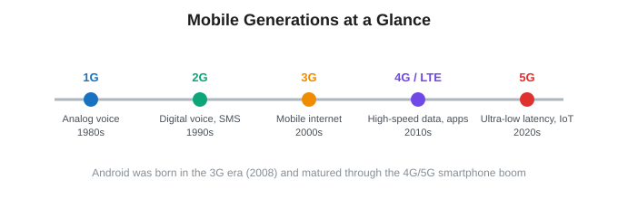
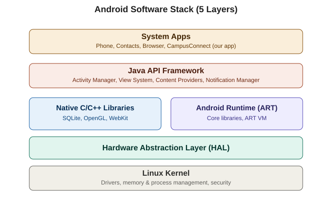
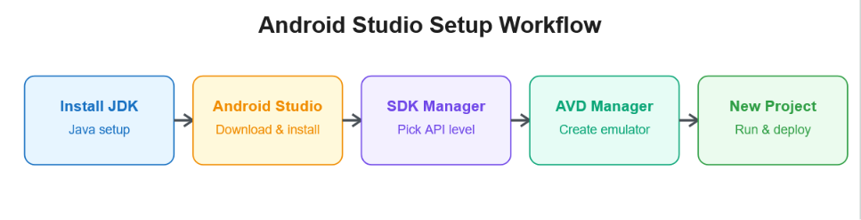
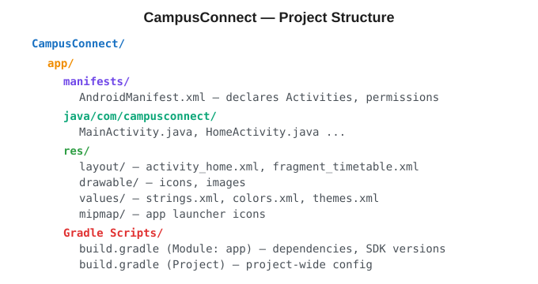
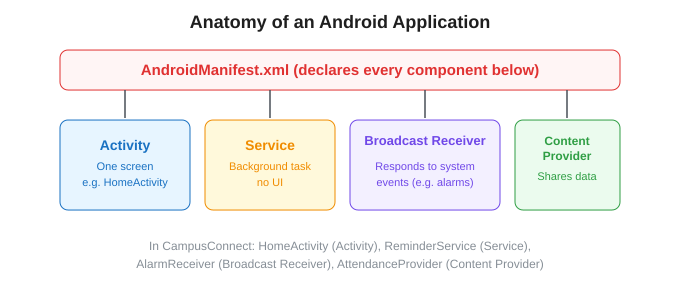

# UNIT 1 — Android Basics

### Reading Material | Diploma (Final Year) & B.Tech II Year | JNTUK

### Subject: Mobile Application Development — CampusConnect Project Track

---

## How This Subject is Organized

This subject is not taught as isolated theory chapters. Everything you learn is applied to **one real app you build across the course: CampusConnect**, a campus utility app (timetable, attendance, announcements, canteen menu, lost & found).

The subject content is split as:

| Share         | Focus Area                                                              | Why                                                                                                                                                                                                                                                                               |
| ------------- | ----------------------------------------------------------------------- | --------------------------------------------------------------------------------------------------------------------------------------------------------------------------------------------------------------------------------------------------------------------------------- |
| **40%** | Core Android Concepts (Activities, Intents, Lifecycle, Storage, SQLite) | This is what JNTUK exams test most heavily, and it's the foundation everything else builds on                                                                                                                                                                                     |
| **30%** | Java + XML Hands-on Coding                                              | You need to*write* this by hand for university practicals and exams                                                                                                                                                                                                             |
| **10%** | React Native (industry-relevant)                                        | Native Android hiring has shrunk; most companies now build mobile apps with React Native, Flutter, or similar cross-platform frameworks. This section shows you how the same concepts (Activities → Screens, Intents → Navigation) map into the tool the industry actually uses |

> Every unit will carry small tags like `[EXAM FOCUS]` and `[INDUSTRY NOTE]` so you know what to prioritize for university exams versus what's useful for placements.

---

## 1.1 Types of Mobile Generations

Before Android, understand *why* smartphones (and Android) became possible — mobile networks had to evolve first.

| Generation | Era   | Key Capability                   | Relevance to Android                                                                       |
| ---------- | ----- | -------------------------------- | ------------------------------------------------------------------------------------------ |
| 1G         | 1980s | Analog voice calls only          | No data  apps impossible                                                                  |
| 2G         | 1990s | Digital voice + SMS              | Basic Java-based feature phones (pre-Android)                                              |
| 3G         | 2000s | Mobile internet (slow)           | **Android launched in this era (2008)** — first Android phones used 3G              |
| 4G / LTE   | 2010s | High-speed data, video streaming | Android app ecosystem exploded — Play Store, rich apps                                    |
| 5G         | 2020s | Ultra-low latency, massive IoT   | Real-time apps, AR/VR, connected devices — modern Android + React Native apps target this |

`[EXAM FOCUS]` Be ready to write short notes distinguishing 2G vs 3G vs 4G vs 5G with one key feature each.

---

## 1.2 History of Android

- **2003** — Android Inc. founded (Andy Rubin, Rich Miner, Nick Sears, Chris White) to build smarter mobile devices.
- **2005** — Google acquires Android Inc.
- **2007** — Open Handset Alliance formed (Google + 84 hardware/software/telecom companies) to build an open mobile platform.
- **2008** — First commercial Android phone: **HTC Dream (T-Mobile G1)**, running Android 1.0.
- Since then, Android has become the world's most widely used mobile operating system, built on the **Linux kernel** and released mostly as **open source** (AOSP — Android Open Source Project).

`[EXAM FOCUS]` "Explain the history and evolution of Android" is a classic 5-mark/10-mark JNTUK question — memorize the founding year, acquisition year, and first phone.

---

## 1.3 Android Version History

Android versions historically used dessert-themed codenames up to Android 9; from Android 10 onward, Google switched to plain numbers.

| Version | Codename           | API Level | Notable For                                      |
| ------- | ------------------ | --------- | ------------------------------------------------ |
| 1.5     | Cupcake            | 3         | First widely used version, on-screen keyboard    |
| 2.2     | Froyo              | 8         | Speed improvements, USB tethering                |
| 2.3     | Gingerbread        | 9         | NFC support                                      |
| 4.0     | Ice Cream Sandwich | 14        | Unified phone/tablet UI                          |
| 4.4     | KitKat             | 19        | Optimized for low-RAM devices                    |
| 5.0     | Lollipop           | 21        | Material Design introduced, ART runtime default  |
| 6.0     | Marshmallow        | 23        | Runtime permissions model                        |
| 7.0     | Nougat             | 24        | Multi-window support                             |
| 8.0     | Oreo               | 26        | Notification channels, background limits         |
| 9       | Pie                | 28        | Adaptive battery, gesture navigation             |
| 10      | —                 | 29        | Dark theme, codename scheme dropped              |
| 11–14  | —                 | 30–34    | Privacy dashboards, scoped storage, Material You |

`[EXAM FOCUS]` You are commonly asked to list versions with codenames and API levels in order — build a memory trick using the alphabet (Cupcake → Donut → Eclair → Froyo → Gingerbread ...).

## Reference: [video](https://www.youtube.com/watch?v=vjSvC7OTHOI&t=10s)

---

## 1.4 Features of Android

- **Open Source** — AOSP is free to use and modify.
- **Layered Architecture** — Linux kernel at the base, UI framework on top (see 1.6).
- **Application Framework Reuse** — apps can publish and consume each other's capabilities (e.g., a Camera intent any app can trigger).
- **Rich UI Support** — Views, Layouts, Material Design components.
- **Connectivity** — GSM, CDMA, Wi-Fi, Bluetooth, NFC.
- **Storage** — SQLite for structured data (Unit 5).
- **Multi-tasking** — background Services, multiple apps running concurrently.
- **Media Support** — audio, video, image formats built in.
- **Multi-language & Multi-touch support.**

---

## 1.5 Android Architecture

This is one of the most frequently asked diagram-based questions in JNTUK exams — **draw and explain the Android architecture.**

**Bottom to top:**

1. **Linux Kernel:** the foundation. Handles device drivers, memory management, process management, power management, and security. Android doesn't reinvent the OS — it sits on Linux.
2. **Hardware Abstraction Layer (HAL):** provides standard interfaces that expose device hardware capabilities (camera, Bluetooth, sensors) to the higher-level Java API framework, without the framework needing to know hardware-specific details.
3. **Native C/C++ Libraries & Android Runtime (ART):** side by side:
   - Native libraries: SQLite (local databases), OpenGL (graphics), WebKit (browser engine), SSL.
   - ART (Android Runtime): compiles and runs your app's bytecode. (Older versions used Dalvik VM — a common exam comparison question is **Dalvik vs ART**.)
4. **Java API Framework:** the layer you (as an Android developer) interact with most directly. Contains the Activity Manager, Window Manager, Content Providers, View System, Notification Manager, and more. Your app's Java/Kotlin code calls into this layer.
5. **System Apps:** the top layer: Phone, Contacts, Browser, Camera — and the apps you build, like **CampusConnect**.

 Practice drawing this exact 5-layer diagram from memory — it appears almost every semester.

 When you later build the same app screens in **React Native**, none of this changes underneath — React Native still runs on this exact Android architecture. React Native simply adds a JavaScript layer that talks to the Java API Framework through a "bridge" (or the newer JSI in recent React Native versions), so your JavaScript code can ultimately trigger the same Activities, Views, and system services shown above.

---

## 1.6 Installing Android Studio, SDK Tools & Creating Your First AVD

**Step-by-step:**

1. **Install JDK** — Android Studio needs a Java Development Kit (recent versions bundle their own JDK, but you should know this dependency exists for exam purposes).
2. **Download & Install Android Studio** — from developer.android.com. It's the official IDE, built on IntelliJ IDEA, bundling everything you need to write, debug, and package Android apps.
3. **SDK Manager** — inside Android Studio, lets you download specific **Android SDK** versions (API levels), platform tools (adb, fastboot), and build tools. You pick a **minimum SDK** (oldest Android version your app supports) and a **target SDK** (version you build/test against) for CampusConnect.
4. **AVD Manager (Android Virtual Device)** — lets you create a virtual phone/tablet to run and test your app without needing a physical device. You choose a device profile (e.g., Pixel 6), a system image (Android version), and RAM/storage settings.
5. **Create New Project → Run** — Android Studio scaffolds a starter project; clicking Run builds and installs it on your AVD or physical device.

### Key Terms

| Term                                      | Meaning                                                                                                        |
| ----------------------------------------- | -------------------------------------------------------------------------------------------------------------- |
| **SDK (Software Development Kit)**  | The full toolset — libraries, APIs, and tools — needed to build Android apps                                 |
| **ADT (Android Development Tools)** | Legacy Eclipse plugin (now obsolete — Android Studio replaced it); mentioned in older syllabi and exam papers |
| **AVD (Android Virtual Device)**    | A configurable Android emulator instance                                                                       |
| **adb (Android Debug Bridge)**      | Command-line tool to communicate with a device/emulator (install apps, view logs)                              |

`[EXAM FOCUS]` "Differentiate SDK, ADT, and AVD" is a common 2-mark/5-mark short question.

---

## 1.7 Android Project Structure

| Folder/File                       | Purpose                                                                                                                                          |
| --------------------------------- | ------------------------------------------------------------------------------------------------------------------------------------------------ |
| `manifests/AndroidManifest.xml` | The app's "identity card" — declares every Activity, Service, permission (e.g., SEND_SMS for our Lost & Found notify feature), and app metadata |
| `java/com/campusconnect/`       | All your Java source code — Activities, Fragments, Adapters, Helper classes                                                                     |
| `res/layout/`                   | XML files defining screen UI (e.g.,`activity_home.xml`)                                                                                        |
| `res/drawable/`                 | Images and icons                                                                                                                                 |
| `res/values/`                   | `strings.xml` (all text, for localization), `colors.xml`, `themes.xml`                                                                     |
| `res/mipmap/`                   | App launcher icons at multiple resolutions                                                                                                       |
| `build.gradle (Module: app)`    | Dependencies,`minSdkVersion`, `targetSdkVersion`, app-level build config                                                                     |
| `build.gradle (Project)`        | Project-wide build settings                                                                                                                      |

`[EXAM FOCUS]` Know what `AndroidManifest.xml` declares — this connects directly to Unit 2 (Activities) and Unit 4 (permissions for SMS/Email/Telephony).

---

## 1.8 Anatomy of an Android Application

Every Android app is built from **four core components**, all declared in the Manifest:

| Component                    | What It Is                                     | In CampusConnect                                                                    |
| ---------------------------- | ---------------------------------------------- | ----------------------------------------------------------------------------------- |
| **Activity**           | A single screen with a UI                      | `HomeActivity`, `TimetableActivity`                                             |
| **Service**            | Runs in the background, no UI                  | A`ReminderService` that checks upcoming classes                                   |
| **Broadcast Receiver** | Listens for and responds to system-wide events | `AlarmReceiver` — fires when a scheduled class reminder alarm goes off           |
| **Content Provider**   | Manages shared access to structured app data   | `AttendanceProvider` — how attendance data could be shared with other components |

`[EXAM FOCUS]` "What are the four main components of an Android application? Explain each with an example" is asked almost every semester — this exact table answers it.

---

## 1.9 Deploying an Application on a Physical Device

1. On your phone: **Settings → About Phone → tap "Build Number" 7 times** to unlock Developer Options.
2. **Settings → Developer Options → enable USB Debugging.**
3. Connect the phone to your computer via USB; accept the "Allow USB debugging?" prompt on the phone.
4. In Android Studio, select your device from the device dropdown (instead of an AVD) and click **Run ▶**.
5. Android Studio compiles the app, generates a debug **APK**, installs it via `adb`, and launches it automatically on your phone.

`[EXAM FOCUS]` Be ready to list these steps in sequence — it's a common short-answer/practical viva question.

---

## 1.10 `[INDUSTRY NOTE]` Where React Native Fits (Preview)

You'll go deeper into React Native later in the course, but here's the map so Unit 1 doesn't feel disconnected from it:

| Native Android Concept (this unit) | React Native Equivalent                                            |
| ---------------------------------- | ------------------------------------------------------------------ |
| Activity (one screen)              | A Screen component (via React Navigation)                          |
| `AndroidManifest.xml`            | `app.json` / native config files (mostly auto-managed)           |
| `res/layout/*.xml`               | JSX — components written in JavaScript, styled with`StyleSheet` |
| SDK / AVD setup in Android Studio  | `npx react-native init`, Metro bundler, same AVD used underneath |
| Java API Framework calls           | React Native "bridge"/JSI calls into the same native APIs          |

The underlying Android OS, architecture, and device APIs you're learning right now don't disappear when you use React Native — they're still running underneath. React Native just changes *which language and toolchain* you use to build the screens.

---

## Unit 1 — Quick Recap

- Android runs on Linux and evolved alongside 3G→5G mobile networks.
- Android's 5-layer architecture: Linux Kernel → HAL → Native Libraries/ART → Java API Framework → System Apps.
- Android Studio + SDK Manager + AVD Manager are the core tools for building and testing apps.
- Every app has a fixed project structure (`manifests/`, `java/`, `res/`, Gradle files) and is built from 4 components: Activity, Service, Broadcast Receiver, Content Provider — all declared in `AndroidManifest.xml`.
- Deploying to a physical device requires enabling Developer Options + USB Debugging.

---

## Practice Questions

**Short Answer (2–5 marks)**

1. Differentiate between SDK, ADT, and AVD.
2. List any five features of Android.
3. What is the role of the Hardware Abstraction Layer (HAL)?
4. Differentiate Dalvik VM and ART.

**Descriptive (10 marks)**

1. Explain the Android architecture with a neat diagram.
2. Explain the history and evolution of Android with key milestones.
3. Explain the anatomy of an Android application with its four core components.
4. Explain step-by-step how to set up Android Studio and deploy an app on a physical device.

**MCQ Practice**

1. Which layer of Android architecture directly contains SQLite? → *Native C/C++ Libraries*
2. The first commercial Android phone was → *HTC Dream (T-Mobile G1)*
3. `AndroidManifest.xml` is located inside which folder? → *manifests/*
4. Which is NOT one of the four core Android components? → *(Options should include a distractor like "Fragment" — Fragments are UI building blocks within an Activity, not one of the 4 core components)*

---

**Next: Unit 2 — Android Anatomy (Activities, Activity Lifecycle, Intents, Navigation) — where CampusConnect gets its first working screens and navigation flow.**
