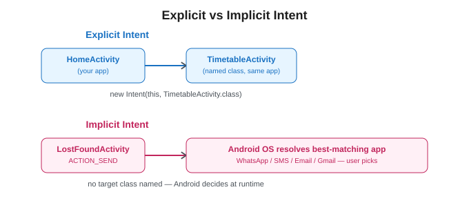
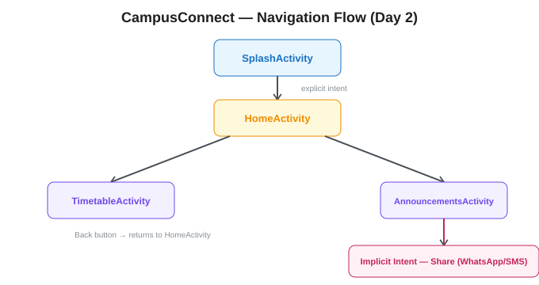

# UNIT 2 — Android Anatomy

### Reading Material | Diploma (Final Year) & B.Tech II Year | JNTUK

### Subject: Mobile Application Development — CampusConnect Project Track

---

## Where We Are

Unit 1 gave you the architecture and tooling. In Unit 2, **CampusConnect gets its first working screens** — a Splash screen, a Home dashboard, and navigation between screens using Activities and Intents. This is also the unit where JNTUK diploma practicals expect you to *write full Java classes and XML layouts by hand*, so every code block here is complete and runnable, not a fragment.

---

## 2.1 Your First Android Application — Setting Up CampusConnect

Every Android project needs, at minimum: one Activity, its XML layout, and a Manifest entry. Here is CampusConnect's starting point.

**`AndroidManifest.xml`**

```xml
<?xml version="1.0" encoding="utf-8"?>
<manifest xmlns:android="http://schemas.android.com/apk/res/android"
    package="com.campusconnect">

    <uses-permission android:name="android.permission.SEND_SMS" />
    <uses-permission android:name="android.permission.CALL_PHONE" />

    <application
        android:allowBackup="true"
        android:icon="@mipmap/ic_launcher"
        android:label="@string/app_name"
        android:theme="@style/Theme.CampusConnect">

        <activity
            android:name=".SplashActivity"
            android:exported="true">
            <intent-filter>
                <action android:name="android.intent.action.MAIN" />
                <category android:name="android.intent.category.LAUNCHER" />
            </intent-filter>
        </activity>

        <activity android:name=".HomeActivity" android:exported="false" />
        <activity android:name=".TimetableActivity" android:exported="false" />
        <activity android:name=".AnnouncementsActivity" android:exported="false" />

    </application>
</manifest>
```

 Notice **only one Activity** (`SplashActivity`) has the `MAIN`/`LAUNCHER` intent-filter, this is what tells Android which screen opens when the user taps the app icon. This is a guaranteed viva question: *"How does Android know which Activity to launch first?"*

---

## 2.2 Android Components — Quick Recap

From Unit 1: Activity, Service, Broadcast Receiver, Content Provider. This unit focuses entirely on **Activities** — the building block of every screen you will build in CampusConnect.

---

## 2.3 Activities

An **Activity** is a single, focused screen that a user can interact with. Every screen — Home, Timetable, Announcements, Lost & Found — is its own Activity class extending `AppCompatActivity`.

**`activity_home.xml`** (layout)

```xml
<?xml version="1.0" encoding="utf-8"?>
<LinearLayout xmlns:android="http://schemas.android.com/apk/res/android"
    android:layout_width="match_parent"
    android:layout_height="match_parent"
    android:orientation="vertical"
    android:padding="16dp">

    <TextView
        android:id="@+id/tvWelcome"
        android:layout_width="wrap_content"
        android:layout_height="wrap_content"
        android:text="Welcome to CampusConnect"
        android:textSize="22sp"
        android:textStyle="bold" />

    <Button
        android:id="@+id/btnTimetable"
        android:layout_width="match_parent"
        android:layout_height="wrap_content"
        android:layout_marginTop="16dp"
        android:text="View Timetable" />

    <Button
        android:id="@+id/btnAnnouncements"
        android:layout_width="match_parent"
        android:layout_height="wrap_content"
        android:layout_marginTop="8dp"
        android:text="Announcements" />

</LinearLayout>
```

**`HomeActivity.java`**

```java
package com.campusconnect;

import android.content.Intent;
import android.os.Bundle;
import android.widget.Button;
import android.widget.TextView;
import androidx.appcompat.app.AppCompatActivity;

public class HomeActivity extends AppCompatActivity {

    private static final String STUDENT_NAME_KEY = "student_name";

    @Override
    protected void onCreate(Bundle savedInstanceState) {
        super.onCreate(savedInstanceState);
        setContentView(R.layout.activity_home);

        TextView tvWelcome = findViewById(R.id.tvWelcome);
        String studentName = getIntent().getStringExtra(STUDENT_NAME_KEY);
        if (studentName != null) {
            tvWelcome.setText("Welcome, " + studentName + "!");
        }

        Button btnTimetable = findViewById(R.id.btnTimetable);
        btnTimetable.setOnClickListener(v -> {
            Intent intent = new Intent(HomeActivity.this, TimetableActivity.class);
            startActivity(intent);
        });

        Button btnAnnouncements = findViewById(R.id.btnAnnouncements);
        btnAnnouncements.setOnClickListener(v -> {
            Intent intent = new Intent(HomeActivity.this, AnnouncementsActivity.class);
            startActivity(intent);
        });
    }
}
```

`[EXAM FOCUS]` Know the boilerplate: every Activity **must** override `onCreate()` and call `setContentView()` to attach its XML layout. `findViewById()` is how Java code gets a reference to a widget defined in XML — this connection (XML defines *what*, Java controls *behaviour*) is asked as a conceptual question often.

---

## 2.4 Activity Lifecycle

An Activity moves through a well-defined set of states as the user opens it, switches away, and returns.


| Callback        | When It Fires                                    | What You Typically Do Here                            |
| --------------- | ------------------------------------------------ | ----------------------------------------------------- |
| `onCreate()`  | Activity is first created                        | Inflate layout, initialize views, set click listeners |
| `onStart()`   | Activity becomes visible                         | Register listeners that need the UI visible           |
| `onResume()`  | Activity is in the foreground, user can interact | Resume animations, camera, sensors                    |
| `onPause()`   | Another Activity is partially covering this one  | Save lightweight state, pause animations/video        |
| `onStop()`    | Activity is no longer visible                    | Release heavier resources                             |
| `onRestart()` | Activity is coming back after being stopped      | Called right before`onStart()` again                |
| `onDestroy()` | Activity is being destroyed                      | Final cleanup                                         |

**Demonstrating the lifecycle with Log statements (a standard JNTUK lab exercise):**

```java
package com.campusconnect;

import android.os.Bundle;
import android.util.Log;
import androidx.appcompat.app.AppCompatActivity;

public class TimetableActivity extends AppCompatActivity {

    private static final String TAG = "TimetableActivity";

    @Override
    protected void onCreate(Bundle savedInstanceState) {
        super.onCreate(savedInstanceState);
        setContentView(R.layout.activity_timetable);
        Log.d(TAG, "onCreate: screen created");
    }

    @Override
    protected void onStart() {
        super.onStart();
        Log.d(TAG, "onStart: becoming visible");
    }

    @Override
    protected void onResume() {
        super.onResume();
        Log.d(TAG, "onResume: user can now interact");
    }

    @Override
    protected void onPause() {
        super.onPause();
        Log.d(TAG, "onPause: losing focus");
    }

    @Override
    protected void onStop() {
        super.onStop();
        Log.d(TAG, "onStop: no longer visible");
    }

    @Override
    protected void onDestroy() {
        super.onDestroy();
        Log.d(TAG, "onDestroy: cleaning up");
    }
}
```

`[EXAM FOCUS]` This is a guaranteed **10-mark descriptive question**: "Explain the Activity lifecycle with a diagram and code example." Practice drawing the diagram from memory *and* writing this exact class structure — diploma practical exams often ask you to submit this as a lab record.

---

## 2.5 Intent Objects

An **Intent** is a messaging object used to request an action from another app component. It is the mechanism behind almost everything that connects screens or apps together in Android.



Two categories:

### 2.5.1 Explicit Intent

You name the **exact class** you want to start. Used for navigation *within your own app* — e.g., Home → Timetable.

```java
Intent intent = new Intent(HomeActivity.this, TimetableActivity.class);
intent.putExtra("selected_day", "Monday");
startActivity(intent);
```

**Receiving the passed data in `TimetableActivity.java`:**

```java
@Override
protected void onCreate(Bundle savedInstanceState) {
    super.onCreate(savedInstanceState);
    setContentView(R.layout.activity_timetable);

    String selectedDay = getIntent().getStringExtra("selected_day");
    if (selectedDay != null) {
        Log.d("TimetableActivity", "Opened for day: " + selectedDay);
    }
}
```

### 2.5.2 Implicit Intent

You **don't** name a target class — you describe an *action*, and Android finds an app on the device capable of handling it. Used for CampusConnect's Lost & Found "notify finder" and "call warden" features.

```java
// Share an announcement text (any app that can handle "send text" shows up)
Intent shareIntent = new Intent(Intent.ACTION_SEND);
shareIntent.setType("text/plain");
shareIntent.putExtra(Intent.EXTRA_TEXT, "Reminder: DBMS class moved to Room 204 today.");
startActivity(Intent.createChooser(shareIntent, "Share announcement via"));

// Call the warden directly (Unit 4 will cover permission handling in detail)
Intent callIntent = new Intent(Intent.ACTION_CALL);
callIntent.setData(Uri.parse("tel:9876543210"));
startActivity(callIntent);

// Compose an email to HOD
Intent emailIntent = new Intent(Intent.ACTION_SENDTO);
emailIntent.setData(Uri.parse("mailto:hod@college.edu"));
emailIntent.putExtra(Intent.EXTRA_SUBJECT, "Lost item found on campus");
startActivity(emailIntent);
```

`[EXAM FOCUS]` "Differentiate Explicit and Implicit Intent with examples" is one of the most frequently repeated questions across JNTUK diploma and B.Tech papers. Structure your answer exactly like the table below.

|                       | Explicit Intent                      | Implicit Intent                                     |
| --------------------- | ------------------------------------ | --------------------------------------------------- |
| Target                | Named class (`ActivityName.class`) | Described action (`ACTION_SEND`, `ACTION_CALL`) |
| Used for              | Navigation within your own app       | Requesting another app to perform a task            |
| Who resolves it       | You specify it directly              | Android OS resolves it at runtime                   |
| CampusConnect example | Home → Timetable                    | Share announcement, Call Warden                     |

---

## 2.6 Navigation Between Activities

Beyond simply opening a new screen, real apps need to **pass data forward** and sometimes **get a result back**. CampusConnect's Lost & Found flow is a good example: post a form → return to the list → the list needs to know a new item was added.

**Passing data forward** (already shown above with `putExtra`/`getStringExtra`).

**Getting a result back — modern approach using the Activity Result API** (this replaces the older, now-deprecated `startActivityForResult`, but you should know both for exam purposes since older JNTUK papers still reference `startActivityForResult`):

```java
// In LostFoundActivity.java — launching the "Post Item" screen and waiting for a result
private final ActivityResultLauncher<Intent> postItemLauncher =
    registerForActivityResult(new ActivityResultContracts.StartActivityForResult(), result -> {
        if (result.getResultCode() == RESULT_OK && result.getData() != null) {
            String newItemTitle = result.getData().getStringExtra("item_title");
            Toast.makeText(this, "Posted: " + newItemTitle, Toast.LENGTH_SHORT).show();
            refreshLostFoundList();
        }
    });

private void openPostItemScreen() {
    Intent intent = new Intent(this, PostItemActivity.class);
    postItemLauncher.launch(intent);
}
```

```java
// In PostItemActivity.java — sending the result back before finishing
private void submitItem() {
    Intent resultIntent = new Intent();
    resultIntent.putExtra("item_title", etItemTitle.getText().toString());
    setResult(RESULT_OK, resultIntent);
    finish();
}
```

**The older exam-relevant syntax (still asked in theory papers):**

```java
// Deprecated but commonly tested
startActivityForResult(intent, REQUEST_CODE);

@Override
protected void onActivityResult(int requestCode, int resultCode, Intent data) {
    super.onActivityResult(requestCode, resultCode, data);
    if (requestCode == REQUEST_CODE && resultCode == RESULT_OK) {
        String itemTitle = data.getStringExtra("item_title");
    }
}
```

**CampusConnect's Day 2 navigation map:**



`[EXAM FOCUS]` Know the difference between `startActivity()` (fire-and-forget navigation) and `startActivityForResult()`/Activity Result API (navigation where you expect data back). Also know that the Android **Back Stack** automatically returns you to the previous Activity — you don't manually code "go back" for the system back button.

---

## 2.7 `[INDUSTRY NOTE]` Navigation in React Native

The same Home → Timetable flow, built with React Native and **React Navigation** (the industry-standard navigation library):

```jsx
// App.js
import { NavigationContainer } from '@react-navigation/native';
import { createNativeStackNavigator } from '@react-navigation/native-stack';
import HomeScreen from './screens/HomeScreen';
import TimetableScreen from './screens/TimetableScreen';

const Stack = createNativeStackNavigator();

export default function App() {
  return (
    <NavigationContainer>
      <Stack.Navigator initialRouteName="Home">
        <Stack.Screen name="Home" component={HomeScreen} />
        <Stack.Screen name="Timetable" component={TimetableScreen} />
      </Stack.Navigator>
    </NavigationContainer>
  );
}
```

```jsx
// screens/HomeScreen.js
import { View, Button, Text } from 'react-native';

export default function HomeScreen({ navigation }) {
  return (
    <View style={{ padding: 16 }}>
      <Text style={{ fontSize: 22, fontWeight: 'bold' }}>Welcome to CampusConnect</Text>
      <Button
        title="View Timetable"
        onPress={() => navigation.navigate('Timetable', { selectedDay: 'Monday' })}
      />
    </View>
  );
}
```

```jsx
// screens/TimetableScreen.js
import { View, Text } from 'react-native';

export default function TimetableScreen({ route }) {
  const { selectedDay } = route.params;
  return (
    <View style={{ padding: 16 }}>
      <Text>Showing timetable for: {selectedDay}</Text>
    </View>
  );
}
```

**The conceptual mapping:**

| Native Android                                           | React Native (React Navigation)                                                  |
| -------------------------------------------------------- | -------------------------------------------------------------------------------- |
| `Activity`                                             | `Screen` component                                                             |
| Explicit Intent (`startActivity`)                      | `navigation.navigate('ScreenName', params)`                                    |
| `intent.putExtra()` / `getIntent().getStringExtra()` | `navigate('Screen', { key: value })` / `route.params`                        |
| Back stack (automatic)                                   | Stack Navigator (automatic, same concept)                                        |
| Activity Result API                                      | `navigation.navigate()` + callback params, or state management (Context/Redux) |

Notice the *concepts* are identical — a stack of screens, forward navigation, passing parameters, an automatic back stack. Only the syntax and language change.

---

## Unit 2 — Quick Recap

- An Activity is one screen; it must override `onCreate()` and call `setContentView()`.
- The Activity Lifecycle (`onCreate → onStart → onResume → onPause → onStop → onDestroy`, with `onRestart` looping back) governs how Android manages screen visibility and resources.
- Explicit Intents navigate within your own app by naming a class; Implicit Intents describe an action and let Android resolve which app handles it.
- Data flows forward via `putExtra()`/`getIntent()`, and back via the Activity Result API (modern) or `startActivityForResult()` (older, still exam-relevant).
- React Native's React Navigation library mirrors these exact concepts — Screens instead of Activities, `navigate()` instead of Intents.

---

## Practice Questions

**Short Answer (2–5 marks)**

1. What is an Intent? List its types.
2. What is the purpose of `setContentView()`?
3. Differentiate `startActivity()` and `startActivityForResult()`.
4. What triggers `onPause()` versus `onStop()`?

**Descriptive (10 marks)**

1. Explain the Activity lifecycle with a neat diagram and a code example showing each callback.
2. Differentiate Explicit and Implicit Intent with suitable Android code examples.
3. Write a Java program to navigate from one Activity to another, passing data using Intent extras.
4. Explain how data can be returned from a child Activity to its parent Activity.

**Lab / Practical**

1. Create two Activities. From the first, pass a student's name to the second using an explicit Intent and display it using `TextView`.
2. Implement an implicit Intent to open the phone dialer with a pre-filled number.
3. Add `Log.d()` statements to every lifecycle callback in an Activity and observe the Logcat output as you rotate the device, press Home, and press Back.

---

**Next: Unit 3 — Android User Interface (Layouts, UI Controls, Fragments, Dialog Fragments) — where CampusConnect's Home screen becomes a real tabbed dashboard with live lists.**
