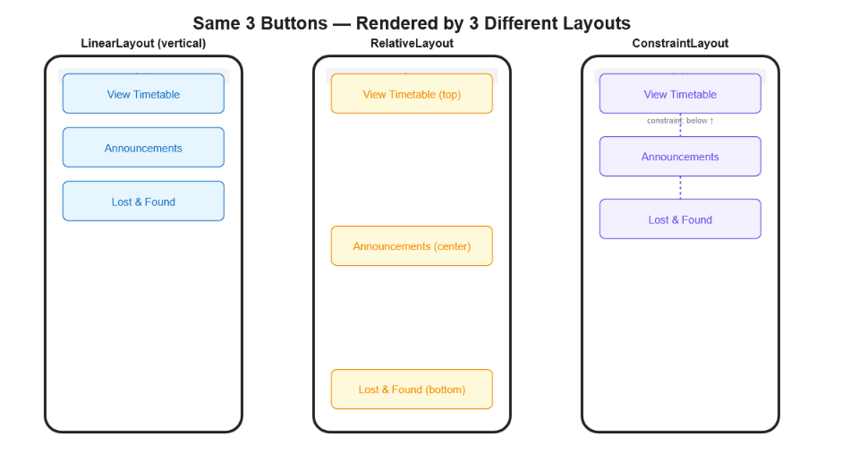
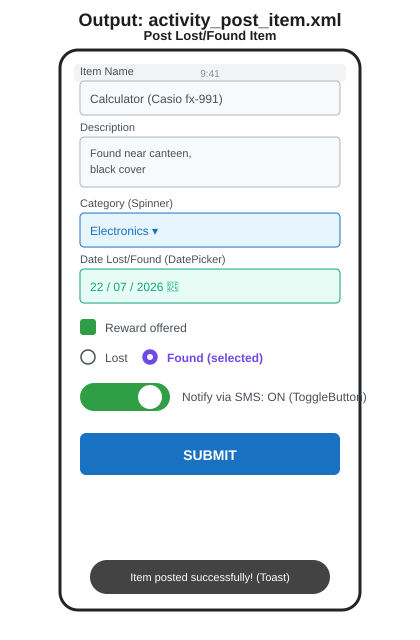
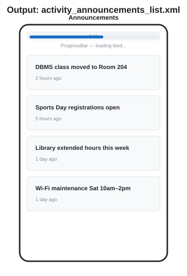
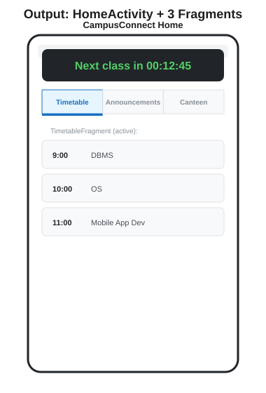
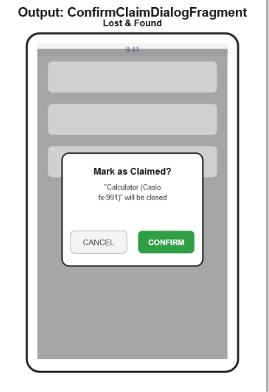

# UNIT 3 — Android User Interface

### Reading Material | Diploma (Final Year) & B.Tech II Year | JNTUK

### Subject: Mobile Application Development — CampusConnect Project Track

---

## Where We Are

Units 1–2 gave CampusConnect a skeleton — screens that exist and can navigate to each other, but with almost nothing on them. **Unit 3 is where the app actually becomes visible and usable.** This is the most frontend-heavy unit in the whole course, so every example below shows the **code** *and* what it **renders as** on screen — read them side by side.

---

## 3.1 Layouts — Linear, Relative, Constraint

A Layout is a `ViewGroup` — a container that decides *where* its child widgets (Buttons, TextViews, etc.) get positioned. Same three buttons, three different layouts, three different results:



**LinearLayout** — stacks children in one direction (`vertical` or `horizontal`), in the order you write them.

```xml
<LinearLayout xmlns:android="http://schemas.android.com/apk/res/android"
    android:layout_width="match_parent"
    android:layout_height="wrap_content"
    android:orientation="vertical">

    <Button android:id="@+id/btnTimetable" android:text="View Timetable"
        android:layout_width="match_parent" android:layout_height="wrap_content" />
    <Button android:id="@+id/btnAnnouncements" android:text="Announcements"
        android:layout_width="match_parent" android:layout_height="wrap_content"
        android:layout_marginTop="8dp" />
</LinearLayout>
```

**RelativeLayout** — positions each child *relative to the parent or to another child* using rules like `layout_centerInParent`, `layout_alignParentBottom`.

```xml
<RelativeLayout xmlns:android="http://schemas.android.com/apk/res/android"
    android:layout_width="match_parent"
    android:layout_height="match_parent">

    <Button android:id="@+id/btnTop" android:text="View Timetable"
        android:layout_width="wrap_content" android:layout_height="wrap_content"
        android:layout_alignParentTop="true" />

    <Button android:id="@+id/btnCenter" android:text="Announcements"
        android:layout_width="wrap_content" android:layout_height="wrap_content"
        android:layout_centerInParent="true" />
</RelativeLayout>
```

**ConstraintLayout** — the modern standard: every child is *constrained* to another view or the parent's edges, forming a flexible graph rather than a strict hierarchy. This is what Android Studio's visual layout editor generates by default.

```xml
<androidx.constraintlayout.widget.ConstraintLayout
    xmlns:android="http://schemas.android.com/apk/res/android"
    xmlns:app="http://schemas.android.com/apk/res-auto"
    android:layout_width="match_parent"
    android:layout_height="match_parent">

    <Button android:id="@+id/btnTimetable" android:text="View Timetable"
        android:layout_width="0dp" android:layout_height="wrap_content"
        app:layout_constraintTop_toTopOf="parent"
        app:layout_constraintStart_toStartOf="parent"
        app:layout_constraintEnd_toEndOf="parent" />

    <Button android:id="@+id/btnAnnouncements" android:text="Announcements"
        android:layout_width="0dp" android:layout_height="wrap_content"
        app:layout_constraintTop_toBottomOf="@id/btnTimetable"
        app:layout_constraintStart_toStartOf="parent"
        app:layout_constraintEnd_toEndOf="parent" />
</androidx.constraintlayout.widget.ConstraintLayout>
```

`[EXAM FOCUS]` "Differentiate LinearLayout, RelativeLayout, and ConstraintLayout" is a guaranteed 5–10 mark question. Answer with: *positioning rule* (order / relative rules / constraints), *performance* (ConstraintLayout avoids nested layouts, so it renders faster on deep UIs), and *use case*.

---

## 3.2 Core UI Controls — Button, TextView, EditText, Toast

You've already used all four in Units 1–2. A `Toast` deserves its own mention — a short, auto-dismissing message that doesn't block the user:

```java
Toast.makeText(this, "Item posted successfully!", Toast.LENGTH_SHORT).show();
```

That single line is what produces the dark rounded message at the bottom of the form mockup in section 3.3 below.

---

## 3.3 Selection Controls — Building the "Post Lost/Found Item" Form

This is where CampusConnect's Lost & Found feature comes together — one screen using **EditText, Spinner, DatePicker, CheckBox, RadioButton, and ToggleButton** all at once.



**`activity_post_item.xml`** (trimmed to the controls that matter — full boilerplate `LinearLayout` wrapper omitted for brevity)

```xml
<EditText
    android:id="@+id/etItemName"
    android:hint="Item Name"
    android:layout_width="match_parent"
    android:layout_height="wrap_content" />

<Spinner
    android:id="@+id/spCategory"
    android:layout_width="match_parent"
    android:layout_height="wrap_content" />

<Button
    android:id="@+id/btnPickDate"
    android:text="Pick Date"
    android:layout_width="wrap_content"
    android:layout_height="wrap_content" />

<CheckBox
    android:id="@+id/cbReward"
    android:text="Reward offered"
    android:layout_width="wrap_content"
    android:layout_height="wrap_content" />

<RadioGroup
    android:id="@+id/rgStatus"
    android:orientation="horizontal"
    android:layout_width="wrap_content"
    android:layout_height="wrap_content">
    <RadioButton android:id="@+id/rbLost" android:text="Lost" />
    <RadioButton android:id="@+id/rbFound" android:text="Found" />
</RadioGroup>

<ToggleButton
    android:id="@+id/tbNotify"
    android:textOn="Notify via SMS: ON"
    android:textOff="Notify via SMS: OFF"
    android:layout_width="wrap_content"
    android:layout_height="wrap_content" />

<Button
    android:id="@+id/btnSubmit"
    android:text="SUBMIT"
    android:layout_width="match_parent"
    android:layout_height="wrap_content" />
```

**`PostItemActivity.java`** — wiring the Spinner and DatePicker (the two controls that need Java setup, unlike CheckBox/RadioButton which work directly off their XML state)

```java
package com.campusconnect;

import android.app.DatePickerDialog;
import android.os.Bundle;
import android.widget.*;
import androidx.appcompat.app.AppCompatActivity;
import java.util.Calendar;

public class PostItemActivity extends AppCompatActivity {

    private TextView tvSelectedDate;

    @Override
    protected void onCreate(Bundle savedInstanceState) {
        super.onCreate(savedInstanceState);
        setContentView(R.layout.activity_post_item);

        // Spinner setup
        Spinner spCategory = findViewById(R.id.spCategory);
        String[] categories = {"Electronics", "Stationery", "ID Cards", "Bottles/Bags", "Other"};
        ArrayAdapter<String> adapter = new ArrayAdapter<>(this,
                android.R.layout.simple_spinner_dropdown_item, categories);
        spCategory.setAdapter(adapter);

        // DatePicker setup
        Button btnPickDate = findViewById(R.id.btnPickDate);
        tvSelectedDate = findViewById(R.id.tvSelectedDate);
        btnPickDate.setOnClickListener(v -> {
            Calendar today = Calendar.getInstance();
            new DatePickerDialog(this, (view, year, month, day) -> {
                tvSelectedDate.setText(day + "/" + (month + 1) + "/" + year);
            }, today.get(Calendar.YEAR), today.get(Calendar.MONTH), today.get(Calendar.DAY_OF_MONTH))
                    .show();
        });

        // Submit
        Button btnSubmit = findViewById(R.id.btnSubmit);
        btnSubmit.setOnClickListener(v -> {
            Toast.makeText(this, "Item posted successfully!", Toast.LENGTH_SHORT).show();
        });
    }
}
```

`[EXAM FOCUS]` Know which controls need an **Adapter** to show data (Spinner, ListView — section 3.4) versus which work directly off XML attributes (CheckBox, RadioButton, ToggleButton). This distinction is commonly tested.

---

## 3.4 ListView — The Announcements Feed

`ListView` is how CampusConnect shows a scrollable feed. It needs an **Adapter** to bridge your data (a list of Strings, or objects) to visible rows.



```java
package com.campusconnect;

import android.os.Bundle;
import android.widget.ArrayAdapter;
import android.widget.ListView;
import androidx.appcompat.app.AppCompatActivity;
import java.util.Arrays;
import java.util.List;

public class AnnouncementsActivity extends AppCompatActivity {

    @Override
    protected void onCreate(Bundle savedInstanceState) {
        super.onCreate(savedInstanceState);
        setContentView(R.layout.activity_announcements_list);

        List<String> announcements = Arrays.asList(
                "DBMS class moved to Room 204",
                "Sports Day registrations open",
                "Library extended hours this week",
                "Wi-Fi maintenance Sat 10am\u20132pm"
        );

        ArrayAdapter<String> adapter = new ArrayAdapter<>(this,
                android.R.layout.simple_list_item_1, announcements);

        ListView lvAnnouncements = findViewById(R.id.lvAnnouncements);
        lvAnnouncements.setAdapter(adapter);

        lvAnnouncements.setOnItemClickListener((parent, view, position, id) -> {
            String selected = announcements.get(position);
            // open a detail screen or share it, per Unit 2's implicit Intent
        });
    }
}
```

```xml
<!-- activity_announcements_list.xml -->
<LinearLayout xmlns:android="http://schemas.android.com/apk/res/android"
    android:layout_width="match_parent"
    android:layout_height="match_parent"
    android:orientation="vertical">

    <ProgressBar
        android:id="@+id/progressBar"
        style="?android:attr/progressBarStyleHorizontal"
        android:layout_width="match_parent"
        android:layout_height="wrap_content" />

    <ListView
        android:id="@+id/lvAnnouncements"
        android:layout_width="match_parent"
        android:layout_height="match_parent" />

</LinearLayout>
```

`[EXAM FOCUS]` "Explain how to populate a ListView using ArrayAdapter" with this exact code is a standard practical/viva question. Know the three arguments to `ArrayAdapter`: context, the row layout resource, and the data source.

---

## 3.5 ProgressBar, Analog Clock, Digital Clock

- **ProgressBar** — shown above, indicates loading (used while announcements fetch from SQLite in Unit 5).
- **Digital/Analog Clock** — simple widgets, mostly used for at-a-glance time display. CampusConnect uses a **digital-style countdown** on the Home dashboard ("Next class in...") — see the mockup in section 3.7.

```xml
<TextClock
    android:id="@+id/digitalClock"
    android:format12Hour="hh:mm:ss a"
    android:layout_width="wrap_content"
    android:layout_height="wrap_content" />
```

`[EXAM FOCUS]` Older JNTUK papers reference the classic `DigitalClock`/`AnalogClock` widgets (both deprecated since API 17); `TextClock` is the modern replacement and safe to demonstrate — but be ready to *name* the older widgets in theory answers since some question banks still use those terms.

---

## 3.6 Handling Events — The Pattern Behind Every Example Above

Every control above follows the same event-handling shape: get a reference with `findViewById()`, then attach a **listener**.

| Control                | Listener                             |
| ---------------------- | ------------------------------------ |
| Button                 | `setOnClickListener(v -> { ... })` |
| Spinner                | `setOnItemSelectedListener(...)`   |
| ListView               | `setOnItemClickListener(...)`      |
| CheckBox / RadioButton | `setOnCheckedChangeListener(...)`  |
| EditText               | `addTextChangedListener(...)`      |

`[EXAM FOCUS]` "What is event handling in Android? Explain with an example" — answer using the Button `OnClickListener` pattern; it's the one every student already has working code for.

---

## 3.7 Fragments — CampusConnect's Tabbed Home Dashboard

A **Fragment** is a reusable, self-contained piece of UI that lives *inside* an Activity — Android's answer to "I want multiple interchangeable screens without creating a new Activity for each." `HomeActivity` now hosts three Fragments behind a tab bar.



**`TimetableFragment.java`**

```java
package com.campusconnect;

import android.os.Bundle;
import android.view.LayoutInflater;
import android.view.View;
import android.view.ViewGroup;
import androidx.fragment.app.Fragment;

public class TimetableFragment extends Fragment {

    @Override
    public View onCreateView(LayoutInflater inflater, ViewGroup container,
                              Bundle savedInstanceState) {
        return inflater.inflate(R.layout.fragment_timetable, container, false);
    }
}
```

**Attaching Fragments dynamically from `HomeActivity.java`:**

```java
private void showFragment(Fragment fragment) {
    getSupportFragmentManager()
            .beginTransaction()
            .replace(R.id.fragmentContainer, fragment)
            .commit();
}

// called when the "Timetable" tab is tapped
btnTabTimetable.setOnClickListener(v -> showFragment(new TimetableFragment()));
btnTabAnnouncements.setOnClickListener(v -> showFragment(new AnnouncementsFragment()));
btnTabCanteen.setOnClickListener(v -> showFragment(new CanteenFragment()));
```

`[EXAM FOCUS]` Know the difference between `Activity.onCreate()` and `Fragment.onCreateView()` — a Fragment doesn't call `setContentView()`; it *returns* an inflated `View` instead. This is one of the most common exam trip-ups.

---

## 3.8 Dialog Fragments — Confirming a Claim

A **DialogFragment** is a Fragment that displays as a floating dialog — used in CampusConnect when a student marks a Lost & Found item as claimed, so an accidental tap doesn't delete it.



```java
package com.campusconnect;

import android.app.AlertDialog;
import android.app.Dialog;
import android.os.Bundle;
import androidx.annotation.NonNull;
import androidx.fragment.app.DialogFragment;

public class ConfirmClaimDialogFragment extends DialogFragment {

    private final String itemName;

    public ConfirmClaimDialogFragment(String itemName) {
        this.itemName = itemName;
    }

    @NonNull
    @Override
    public Dialog onCreateDialog(Bundle savedInstanceState) {
        return new AlertDialog.Builder(requireActivity())
                .setTitle("Mark as Claimed?")
                .setMessage("\"" + itemName + "\" will be closed and removed from the board.")
                .setPositiveButton("CONFIRM", (dialog, which) -> {
                    // update SQLite record (Unit 5) — mark item as claimed
                })
                .setNegativeButton("CANCEL", (dialog, which) -> dialog.dismiss())
                .create();
    }
}
```

**Showing it from `LostFoundActivity.java`:**

```java
new ConfirmClaimDialogFragment("Calculator (Casio fx-991)")
        .show(getSupportFragmentManager(), "confirm_claim");
```

`[EXAM FOCUS]` "Differentiate AlertDialog and DialogFragment" — a DialogFragment *survives configuration changes* (like screen rotation) because it's managed by the FragmentManager, whereas a raw `AlertDialog` shown directly from an Activity gets leaked/lost on rotation. This is the answer examiners are looking for.

---

## 3.9 `[INDUSTRY NOTE]` The Same Screens in React Native

| Native Android (this unit)                       | React Native Equivalent                                                                                                     |
| ------------------------------------------------ | --------------------------------------------------------------------------------------------------------------------------- |
| LinearLayout / RelativeLayout / ConstraintLayout | `<View>` + Flexbox (`flexDirection`, `justifyContent`, `alignItems`) — **one** layout model instead of three |
| EditText                                         | `<TextInput>`                                                                                                             |
| Spinner                                          | `<Picker>` (community package `@react-native-picker/picker`)                                                            |
| CheckBox / RadioButton / ToggleButton            | `<Switch>`, or custom-styled `<TouchableOpacity>`                                                                       |
| ListView                                         | `<FlatList>` — and it's the *default* choice; ListView-equivalent is rarely used directly anymore                      |
| Toast                                            | `ToastAndroid.show(...)` (Android-only) or the cross-platform `react-native-toast-message` package                      |
| Fragment                                         | Just another React component — RN doesn't distinguish "screen" from "reusable UI piece" the way Android does               |
| DialogFragment                                   | `<Modal>` component                                                                                                       |

```jsx
// Same Lost & Found form, React Native version (excerpt)
import { View, TextInput, Switch, FlatList } from 'react-native';
import { Picker } from '@react-native-picker/picker';

function PostItemForm() {
  const [category, setCategory] = useState('Electronics');
  const [rewardOffered, setRewardOffered] = useState(false);

  return (
    <View style={{ padding: 16 }}>
      <TextInput placeholder="Item Name" style={{ borderWidth: 1, padding: 8 }} />
      <Picker selectedValue={category} onValueChange={setCategory}>
        <Picker.Item label="Electronics" value="Electronics" />
        <Picker.Item label="Stationery" value="Stationery" />
      </Picker>
      <Switch value={rewardOffered} onValueChange={setRewardOffered} />
    </View>
  );
}
```

Notice React Native collapses three XML layout types into **one** Flexbox model, and Spinner/CheckBox/ToggleButton into fewer, more composable components — a direct consequence of JavaScript + component-based UI vs. Android's XML + widget-class model.

---

## Unit 3 — Quick Recap

- Three layout types position children differently: LinearLayout (sequential), RelativeLayout (relative rules), ConstraintLayout (constraint graph, the modern default).
- Selection controls (Spinner, DatePicker, CheckBox, RadioButton, ToggleButton) each have their own setup pattern — some need Adapters, some work directly off XML.
- ListView + ArrayAdapter is the standard way to show scrollable data-driven lists.
- Every interactive control follows the same shape: `findViewById()` + a listener.
- Fragments let one Activity host multiple interchangeable UI sections (tabs); DialogFragments are Fragments that float and survive rotation, unlike raw AlertDialogs.
- React Native replaces Android's three-layout system with one Flexbox model, and maps most controls 1:1 with simpler, more composable components.

---

## Practice Questions

**Short Answer (2–5 marks)**

1. Differentiate LinearLayout and RelativeLayout.
2. What is the purpose of an Adapter in Android?
3. Differentiate AlertDialog and DialogFragment.
4. What is the role of `onCreateView()` in a Fragment?

**Descriptive (10 marks)**

1. Explain the three layout types in Android with XML examples for each.
2. Explain how to populate a ListView using ArrayAdapter with a complete code example.
3. Explain Fragments and their lifecycle; write code to dynamically replace a Fragment inside an Activity.
4. Design and explain a form using EditText, Spinner, CheckBox, RadioButton, and ToggleButton.

**Lab / Practical**

1. Build the "Post Lost/Found Item" form exactly as shown in section 3.3 and wire up the Spinner and DatePicker.
2. Convert the Announcements screen from a static layout to a ListView backed by an ArrayAdapter.
3. Create three Fragments and wire tab buttons in `HomeActivity` to switch between them using `FragmentManager`.
4. Implement `ConfirmClaimDialogFragment` and trigger it from a long-press (Context Menu) on a Lost & Found list item.

---

**Next: Unit 4 — Advanced Android (Menus, Images, Alert Dialogs, Alarm Manager, SMS/Email/Telephony, Media Player) — where CampusConnect gets its device-integration features.**
