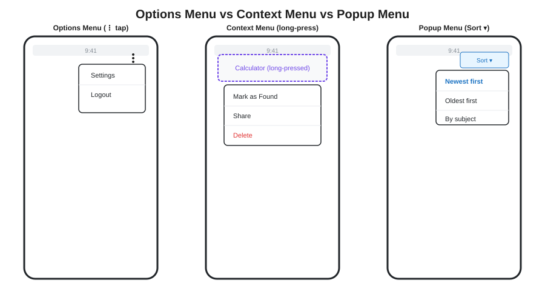
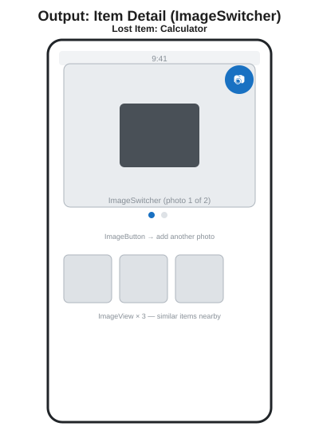
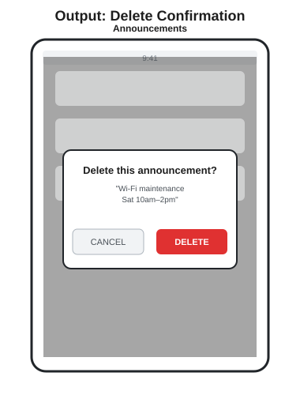
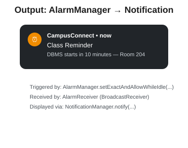
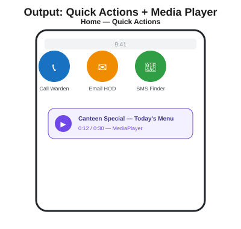

# UNIT 4 — Advanced Android

### Reading Material | Diploma (Final Year) & B.Tech II Year | JNTUK

### Subject: Mobile Application Development — CampusConnect Project Track

---

## Where We Are

Units 1–3 gave CampusConnect its screens, navigation, and data-entry forms. **Unit 4 is where the app stops being "just a UI" and starts talking to the rest of the phone** — menus for actions, photos for evidence, dialogs for confirmation, alarms for reminders, and direct calls/SMS/email/audio through other apps and hardware.

---

## 4.1 Menus — Options, Context, Popup

Three different menus, three different triggers, all used somewhere in CampusConnect:



### Options Menu (top toolbar — Settings/Logout on Home)

```java
@Override
public boolean onCreateOptionsMenu(Menu menu) {
    getMenuInflater().inflate(R.menu.home_menu, menu);
    return true;
}

@Override
public boolean onOptionsItemSelected(MenuItem item) {
    if (item.getItemId() == R.id.action_settings) {
        startActivity(new Intent(this, ProfileActivity.class));
        return true;
    } else if (item.getItemId() == R.id.action_logout) {
        SharedPreferences prefs = getSharedPreferences("session", MODE_PRIVATE);
        prefs.edit().clear().apply();   // preview of Unit 5's SharedPreferences
        finish();
        return true;
    }
    return super.onOptionsItemSelected(item);
}
```

```xml
<!-- res/menu/home_menu.xml -->
<menu xmlns:android="http://schemas.android.com/apk/res/android">
    <item android:id="@+id/action_settings" android:title="Settings" />
    <item android:id="@+id/action_logout" android:title="Logout" />
</menu>
```

### Context Menu (long-press a Lost & Found item)

```java
registerForContextMenu(lvLostFoundItems);

@Override
public void onCreateContextMenu(ContextMenu menu, View v, ContextMenu.ContextMenuInfo menuInfo) {
    getMenuInflater().inflate(R.menu.lost_item_context_menu, menu);
}

@Override
public boolean onContextItemSelected(MenuItem item) {
    AdapterView.AdapterContextMenuInfo info =
            (AdapterView.AdapterContextMenuInfo) item.getMenuInfo();
    String selectedItem = lostFoundList.get(info.position);

    if (item.getItemId() == R.id.action_mark_found) {
        new ConfirmClaimDialogFragment(selectedItem)
                .show(getSupportFragmentManager(), "confirm_claim");   // from Unit 3
        return true;
    }
    return super.onContextItemSelected(item);
}
```

### Popup Menu (Sort button on Announcements)

```java
Button btnSort = findViewById(R.id.btnSort);
btnSort.setOnClickListener(v -> {
    PopupMenu popup = new PopupMenu(this, btnSort);
    popup.getMenuInflater().inflate(R.menu.sort_menu, popup.getMenu());
    popup.setOnMenuItemClickListener(item -> {
        if (item.getItemId() == R.id.sort_newest) sortByNewest();
        else if (item.getItemId() == R.id.sort_oldest) sortByOldest();
        return true;
    });
    popup.show();
});
```

`[EXAM FOCUS]` "Differentiate Options Menu, Context Menu, and Popup Menu" — answer with *trigger* (toolbar tap / long-press / anchor-view tap), *scope* (whole screen / one list item / one button), and one CampusConnect example each, exactly as above.

---

## 4.2 Images — ImageView, ImageButton, ImageSwitcher

Lost & Found items need photos as evidence — this is where all three image widgets earn their place.



```xml
<!-- ImageSwitcher: swipe between multiple photos of one item -->
<ImageSwitcher
    android:id="@+id/imageSwitcher"
    android:layout_width="match_parent"
    android:layout_height="200dp" />

<!-- ImageButton: tap to add another photo -->
<ImageButton
    android:id="@+id/btnAddPhoto"
    android:src="@drawable/ic_camera"
    android:layout_width="48dp"
    android:layout_height="48dp"
    android:background="@android:color/transparent" />
```

```java
ImageSwitcher imageSwitcher = findViewById(R.id.imageSwitcher);
imageSwitcher.setFactory(() -> {
    ImageView imageView = new ImageView(this);
    imageView.setScaleType(ImageView.ScaleType.CENTER_CROP);
    return imageView;
});

int[] itemPhotos = {R.drawable.item_photo_1, R.drawable.item_photo_2};
int currentIndex = 0;

ImageButton btnNextPhoto = findViewById(R.id.btnNextPhoto);
btnNextPhoto.setOnClickListener(v -> {
    currentIndex = (currentIndex + 1) % itemPhotos.length;
    imageSwitcher.setImageResource(itemPhotos[currentIndex]);
});
```

`[EXAM FOCUS]` Know the distinction: `ImageView` displays one static image; `ImageButton` is a clickable `ImageView` (extends it); `ImageSwitcher` animates between two images using a `ViewFactory` — this factory requirement is the detail examiners check for.

---

## 4.3 Alert Dialog

A simpler cousin of Unit 3's `DialogFragment` — a plain `AlertDialog` shown directly from an Activity, fine for quick confirmations that don't need to survive screen rotation.



```java
private void confirmDelete(String announcementText) {
    new AlertDialog.Builder(this)
            .setTitle("Delete this announcement?")
            .setMessage("\"" + announcementText + "\"")
            .setPositiveButton("DELETE", (dialog, which) -> {
                announcements.remove(announcementText);
                adapter.notifyDataSetChanged();
            })
            .setNegativeButton("CANCEL", null)
            .show();
}
```

`[EXAM FOCUS]` This is the direct companion question to Unit 3's DialogFragment question: **"When would you use AlertDialog directly instead of a DialogFragment?"** → Answer: short-lived confirmations tied to a single, simple action, where surviving configuration changes (rotation) doesn't matter. For anything more persistent or reusable, prefer DialogFragment.

---

## 4.4 Alarm Manager — Class Reminders

`AlarmManager` schedules code to run at a future time, even if the app isn't open — CampusConnect uses it for "remind me 10 minutes before my next class."



```java
// Scheduling the alarm — e.g., from HomeActivity when a student taps "Set Reminder"
AlarmManager alarmManager = (AlarmManager) getSystemService(Context.ALARM_SERVICE);

Intent alarmIntent = new Intent(this, AlarmReceiver.class);
alarmIntent.putExtra("class_name", "DBMS");
alarmIntent.putExtra("room", "Room 204");

PendingIntent pendingIntent = PendingIntent.getBroadcast(
        this, 0, alarmIntent, PendingIntent.FLAG_IMMUTABLE);

long triggerTime = System.currentTimeMillis() + (10 * 60 * 1000); // 10 minutes from now
alarmManager.setExactAndAllowWhileIdle(
        AlarmManager.RTC_WAKEUP, triggerTime, pendingIntent);
```

```java
// AlarmReceiver.java — a BroadcastReceiver (from Unit 1's four core components)
public class AlarmReceiver extends BroadcastReceiver {

    @Override
    public void onReceive(Context context, Intent intent) {
        String className = intent.getStringExtra("class_name");
        String room = intent.getStringExtra("room");

        NotificationCompat.Builder builder = new NotificationCompat.Builder(context, "class_reminders")
                .setSmallIcon(R.drawable.ic_notification)
                .setContentTitle("Class Reminder")
                .setContentText(className + " starts in 10 minutes \u2014 " + room)
                .setPriority(NotificationCompat.PRIORITY_HIGH);

        NotificationManagerCompat.from(context).notify(1, builder.build());
    }
}
```

```xml
<!-- AndroidManifest.xml addition -->
<receiver android:name=".AlarmReceiver" android:exported="false" />
```

`[EXAM FOCUS]` This example ties Unit 1 (BroadcastReceiver), Unit 2 (Intent/PendingIntent), and Unit 4 together — expect a question asking you to trace exactly this flow: *AlarmManager schedules → system fires the alarm at the set time → AlarmReceiver's onReceive() runs → NotificationManager shows the alert.*

---

## 4.5 SMS, Email, Telephony Manager

CampusConnect's "quick actions" row — notify a finder, email the HOD, or call the warden — all reuse Unit 2's **implicit Intent** pattern.



```java
Button btnCallWarden = findViewById(R.id.btnCallWarden);
btnCallWarden.setOnClickListener(v -> {
    Intent callIntent = new Intent(Intent.ACTION_DIAL); // opens dialer, doesn't auto-call
    callIntent.setData(Uri.parse("tel:9876543210"));
    startActivity(callIntent);
});

Button btnEmailHod = findViewById(R.id.btnEmailHod);
btnEmailHod.setOnClickListener(v -> {
    Intent emailIntent = new Intent(Intent.ACTION_SENDTO);
    emailIntent.setData(Uri.parse("mailto:hod@college.edu"));
    emailIntent.putExtra(Intent.EXTRA_SUBJECT, "Lost item found on campus");
    startActivity(emailIntent);
});

Button btnSmsFinder = findViewById(R.id.btnSmsFinder);
btnSmsFinder.setOnClickListener(v -> {
    Intent smsIntent = new Intent(Intent.ACTION_SENDTO);
    smsIntent.setData(Uri.parse("smsto:9876543210"));
    smsIntent.putExtra("sms_body", "Hi, I think I found your calculator near the canteen.");
    startActivity(smsIntent);
});
```

**Reading network/SIM info with TelephonyManager** (needs a runtime permission check — covered fully with SQLite permissions in Unit 5):

```java
TelephonyManager telephonyManager = (TelephonyManager) getSystemService(Context.TELEPHONY_SERVICE);
String networkOperator = telephonyManager.getNetworkOperatorName();
Log.d("TelephonyManager", "Connected to: " + networkOperator);
```

`[EXAM FOCUS]` Know `ACTION_DIAL` (opens dialer, user must tap call — no special permission needed) versus `ACTION_CALL` (calls directly — requires the `CALL_PHONE` runtime permission, declared in the Manifest as shown in Unit 2). This distinction is a favorite trick question.

---

## 4.6 Media Player — Canteen Audio Announcement

```java
private MediaPlayer mediaPlayer;

private void playCanteenSpecial() {
    mediaPlayer = MediaPlayer.create(this, R.raw.canteen_special_audio);
    mediaPlayer.start();
}

@Override
protected void onDestroy() {
    super.onDestroy();
    if (mediaPlayer != null) {
        mediaPlayer.release();   // always release — this is the #1 exam trip-up
        mediaPlayer = null;
    }
}
```

`[EXAM FOCUS]` "Why must `MediaPlayer.release()` be called?" — because `MediaPlayer` holds onto native (non-Java) system resources; forgetting to release it causes resource leaks across Activity restarts. Tie this back to the Activity Lifecycle (Unit 2) — `onDestroy()` is exactly where cleanup like this belongs.

---

## 4.7 `[INDUSTRY NOTE]` The Same Features in React Native

| Native Android (this unit)                             | React Native Equivalent                                                                                                             |
| ------------------------------------------------------ | ----------------------------------------------------------------------------------------------------------------------------------- |
| Options / Context / Popup Menu                         | No direct equivalent — typically a custom`<Modal>` dropdown, or community packages like `react-native-popup-menu`              |
| ImageView / ImageButton / ImageSwitcher                | `<Image>` component; switching = conditional rendering or `<Animated.Image>`                                                    |
| AlertDialog                                            | `Alert.alert(title, message, buttons)` — built into React Native core                                                            |
| AlarmManager + BroadcastReceiver + NotificationManager | `@notifee/react-native` or `expo-notifications` for local/scheduled notifications — one library replaces three Android classes |
| `ACTION_DIAL` / `ACTION_SENDTO` (SMS, Email)       | The`Linking` API — `Linking.openURL('tel:...')`, `Linking.openURL('mailto:...')`, `Linking.openURL('sms:...')`             |
| MediaPlayer                                            | `expo-av` (`Audio.Sound`) or `react-native-sound`                                                                             |

```jsx
// Same quick-actions row, React Native version
import { Linking, Alert } from 'react-native';

function callWarden() {
  Linking.openURL('tel:9876543210');
}

function confirmDelete(announcementText, onDelete) {
  Alert.alert(
    'Delete this announcement?',
    `"${announcementText}"`,
    [
      { text: 'CANCEL', style: 'cancel' },
      { text: 'DELETE', style: 'destructive', onPress: onDelete },
    ]
  );
}
```

Notice how much React Native compresses here — `Alert.alert()` alone replaces the `AlertDialog.Builder` pattern in one function call, and `Linking` unifies dial/SMS/email under one API instead of three separate `Intent` action constants. This is exactly the kind of productivity gain companies cite when choosing React Native for MVPs.

---

## Unit 4 — Quick Recap

- Three menu types differ by trigger and scope: Options (toolbar), Context (long-press), Popup (anchored to a view).
- ImageView shows, ImageButton is clickable, ImageSwitcher animates between images via a `ViewFactory`.
- AlertDialog is for quick, one-off confirmations; DialogFragment (Unit 3) survives rotation and is preferred for anything more persistent.
- AlarmManager + PendingIntent + BroadcastReceiver + NotificationManager together form Android's scheduled-reminder pipeline.
- `ACTION_DIAL`/`ACTION_SENDTO` reuse Unit 2's implicit Intent pattern for calls, SMS, and email without needing to build that functionality yourself.
- MediaPlayer must always be released in `onDestroy()` to avoid resource leaks.
- React Native consistently trades several small Android classes for one cross-platform API (`Alert`, `Linking`, notification libraries).

---

## Practice Questions

**Short Answer (2–5 marks)**

1. Differentiate Options Menu, Context Menu, and Popup Menu.
2. What is the difference between `ACTION_DIAL` and `ACTION_CALL`?
3. Why must `MediaPlayer.release()` be called in `onDestroy()`?
4. Differentiate ImageView, ImageButton, and ImageSwitcher.

**Descriptive (10 marks)**

1. Explain how to create and handle a Context Menu with a complete code example.
2. Explain the working of AlarmManager with a BroadcastReceiver, tracing the full flow from scheduling to notification.
3. Write code to send an SMS and an Email using implicit Intents, and explain the required Manifest permissions.
4. Explain the AlertDialog class with a practical example.

**Lab / Practical**

1. Add an Options Menu to `HomeActivity` with Settings and Logout items.
2. Implement a Context Menu on the Lost & Found ListView with "Mark as Found" and "Delete" options.
3. Schedule an AlarmManager reminder that fires a notification after a short delay (use 10 seconds instead of 10 minutes for testing).
4. Add Call Warden, Email HOD, and SMS Finder buttons to the Home quick-actions row using implicit Intents.

---

**Next: Unit 5 — Database & Persistence (SharedPreferences, Internal/External Storage, Content Provider, SQLite CRUD, Publishing & Deployment) — where CampusConnect's data finally survives app restarts.**
