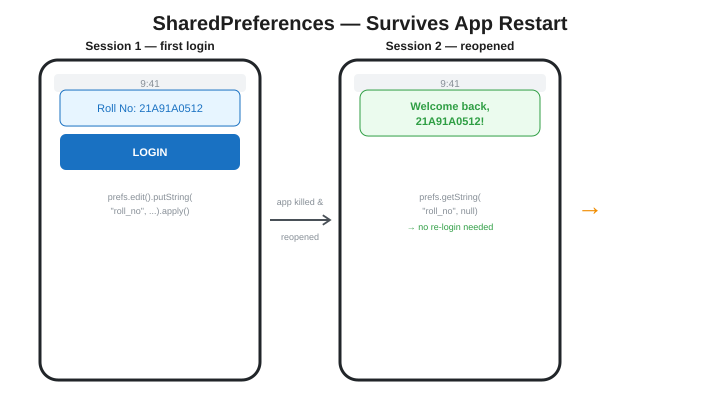
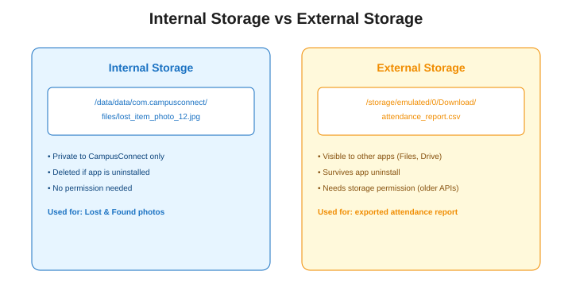
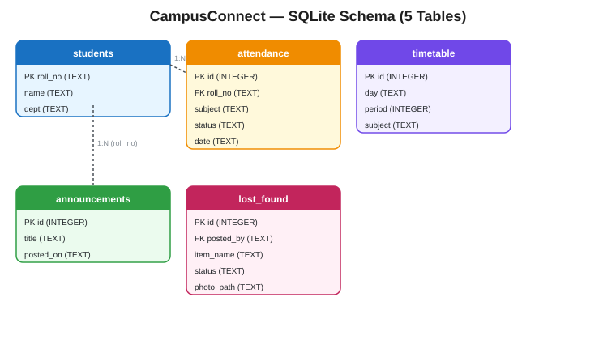
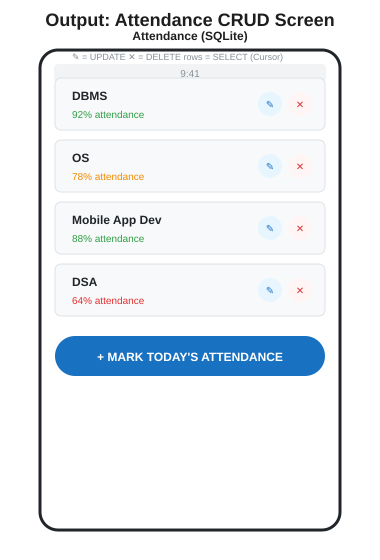
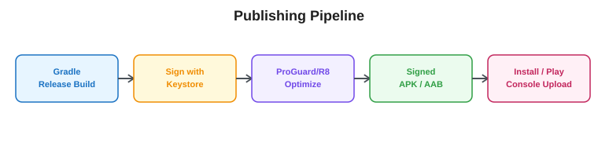

# UNIT 5 — Database & Persistence
### Reading Material | Diploma (Final Year) & B.Tech II Year | JNTUK
### Subject: Mobile Application Development — CampusConnect Project Track

---

## Where We Are

Everything CampusConnect has shown so far — timetable rows, announcements, form inputs — has lived only in memory. Close the app, and it's gone. **Unit 5 fixes that.** By the end of this unit, attendance, announcements, and Lost & Found posts all survive app restarts, phone reboots, and even come back after the app is force-closed. This is also the unit where CampusConnect becomes a genuinely finished app — Unit 6 only adds packaging and publishing on top of what you build here.

---

## 5.1 Persistent Storage — Choosing the Right Tool

Android gives you four storage options, each suited to a different kind of data:

| Mechanism | Best For | CampusConnect Uses It For |
|---|---|---|
| SharedPreferences | Small key-value settings | Login session, theme, last-viewed tab |
| Internal Storage | Files private to your app | Lost & Found item photos |
| External Storage | Files meant to be shared/exported | Exported attendance report (CSV) |
| SQLite Database | Structured, relational, queryable data | Students, attendance, timetable, announcements, lost_found |

`[EXAM FOCUS]` "Compare the different data storage options in Android" is a guaranteed question — structure your answer exactly like the table above: *what kind of data*, *scope/visibility*, *typical use case*.

---

## 5.2 SharedPreferences — Keeping Students Logged In



```java
// Saving the session — called once, right after login
SharedPreferences prefs = getSharedPreferences("session", MODE_PRIVATE);
SharedPreferences.Editor editor = prefs.edit();
editor.putString("roll_no", "21A91A0512");
editor.putBoolean("is_logged_in", true);
editor.apply();   // asynchronous write — use apply(), not commit(), unless you need the return value immediately
```

```java
// Reading it back — e.g., in SplashActivity, to decide where to navigate
SharedPreferences prefs = getSharedPreferences("session", MODE_PRIVATE);
boolean isLoggedIn = prefs.getBoolean("is_logged_in", false);

if (isLoggedIn) {
    String rollNo = prefs.getString("roll_no", null);
    startActivity(new Intent(this, HomeActivity.class));
} else {
    startActivity(new Intent(this, LoginActivity.class));
}
finish();
```

`[EXAM FOCUS]` Know `apply()` vs `commit()`: `apply()` writes asynchronously in the background (preferred — doesn't block the UI thread); `commit()` writes synchronously and returns a `boolean` success flag. This exact distinction is asked almost every semester.

---

## 5.3 Internal Storage — Lost & Found Photos

Files saved here are private to CampusConnect and deleted automatically if the app is uninstalled — ideal for photos that only make sense inside the app.

```java
private String savePhotoInternally(Bitmap photoBitmap, String itemId) {
    String filename = "lost_item_" + itemId + ".jpg";
    try (FileOutputStream fos = openFileOutput(filename, Context.MODE_PRIVATE)) {
        photoBitmap.compress(Bitmap.CompressFormat.JPEG, 85, fos);
        return getFilesDir() + "/" + filename;   // path stored in SQLite's lost_found.photo_path
    } catch (IOException e) {
        Log.e("InternalStorage", "Failed to save photo", e);
        return null;
    }
}
```

---

## 5.4 External Storage — Exporting the Attendance Report

Files here are visible to other apps (Files app, Google Drive) and survive even if CampusConnect is uninstalled — the right choice when a student wants to *keep or share* something outside the app.



```java
private void exportAttendanceReport(List<String> attendanceRows) {
    File downloadsDir = getExternalFilesDir(Environment.DIRECTORY_DOWNLOADS);
    File reportFile = new File(downloadsDir, "attendance_report.csv");

    try (FileWriter writer = new FileWriter(reportFile)) {
        writer.append("Subject,Attendance %\n");
        for (String row : attendanceRows) {
            writer.append(row).append("\n");
        }
        Toast.makeText(this, "Report saved to Downloads", Toast.LENGTH_SHORT).show();
    } catch (IOException e) {
        Log.e("ExternalStorage", "Export failed", e);
    }
}
```

`[EXAM FOCUS]` "Differentiate Internal and External Storage" is a direct 5-mark repeat question — use *visibility*, *persistence after uninstall*, and *permission requirements* as your three comparison points.

---

## 5.5 Content Provider — The Concept

A `ContentProvider` is how one app exposes its structured data to *other* apps in a controlled way — it's the mechanism behind how the Contacts app lets your Email app read contact names, or how CampusConnect *could* later let a college-wide "SuperApp" read attendance data without directly touching CampusConnect's SQLite file.

```java
// Conceptual sketch — CampusConnect doesn't need a full custom Provider yet,
// but every ContentProvider follows this shape:
public class AttendanceProvider extends ContentProvider {
    @Override
    public Cursor query(Uri uri, String[] projection, String selection,
                         String[] selectionArgs, String sortOrder) {
        // returns attendance rows to whichever app made the request,
        // via a content:// URI instead of direct file/database access
        return dbHelper.getReadableDatabase().query("attendance",
                projection, selection, selectionArgs, null, null, sortOrder);
    }
    // insert(), update(), delete(), getType() must also be implemented
}
```

`[EXAM FOCUS]` You are far more likely to be asked to *explain the purpose* of Content Providers than to write a full implementation — know that they standardize cross-app data access through `content://` URIs, the same pattern Android itself uses for Contacts, MediaStore (photos), and CallLog.

---

## 5.6 SQLite — Designing CampusConnect's Schema



```sql
CREATE TABLE students (
    roll_no TEXT PRIMARY KEY,
    name TEXT NOT NULL,
    dept TEXT
);

CREATE TABLE attendance (
    id INTEGER PRIMARY KEY AUTOINCREMENT,
    roll_no TEXT,
    subject TEXT NOT NULL,
    status TEXT NOT NULL,      -- 'PRESENT' or 'ABSENT'
    date TEXT NOT NULL,
    FOREIGN KEY (roll_no) REFERENCES students(roll_no)
);

CREATE TABLE timetable (
    id INTEGER PRIMARY KEY AUTOINCREMENT,
    day TEXT NOT NULL,
    period INTEGER NOT NULL,
    subject TEXT NOT NULL
);

CREATE TABLE announcements (
    id INTEGER PRIMARY KEY AUTOINCREMENT,
    title TEXT NOT NULL,
    posted_on TEXT NOT NULL
);

CREATE TABLE lost_found (
    id INTEGER PRIMARY KEY AUTOINCREMENT,
    posted_by TEXT,
    item_name TEXT NOT NULL,
    status TEXT NOT NULL,      -- 'LOST', 'FOUND', 'CLAIMED'
    photo_path TEXT,
    FOREIGN KEY (posted_by) REFERENCES students(roll_no)
);
```

`[EXAM FOCUS]` Practice drawing this schema with Primary Keys and Foreign Keys marked — "Design a database schema for a student attendance system" is a very common descriptive question, and this is a ready-made answer.

---

## 5.7 SQLite CRUD — SQLiteOpenHelper in Full

**`CampusConnectDbHelper.java`** — the single class that manages database creation and versioning.
```java
package com.campusconnect;

import android.content.ContentValues;
import android.content.Context;
import android.database.Cursor;
import android.database.sqlite.SQLiteDatabase;
import android.database.sqlite.SQLiteOpenHelper;
import java.util.ArrayList;
import java.util.List;

public class CampusConnectDbHelper extends SQLiteOpenHelper {

    private static final String DATABASE_NAME = "campusconnect.db";
    private static final int DATABASE_VERSION = 1;

    public CampusConnectDbHelper(Context context) {
        super(context, DATABASE_NAME, null, DATABASE_VERSION);
    }

    @Override
    public void onCreate(SQLiteDatabase db) {
        db.execSQL("CREATE TABLE attendance (" +
                "id INTEGER PRIMARY KEY AUTOINCREMENT, " +
                "roll_no TEXT, subject TEXT NOT NULL, " +
                "status TEXT NOT NULL, date TEXT NOT NULL)");
        // ... other CREATE TABLE statements from section 5.6
    }

    @Override
    public void onUpgrade(SQLiteDatabase db, int oldVersion, int newVersion) {
        db.execSQL("DROP TABLE IF EXISTS attendance");
        onCreate(db);
    }

    // -------- INSERT --------
    public long markAttendance(String rollNo, String subject, String status, String date) {
        SQLiteDatabase db = getWritableDatabase();
        ContentValues values = new ContentValues();
        values.put("roll_no", rollNo);
        values.put("subject", subject);
        values.put("status", status);
        values.put("date", date);
        return db.insert("attendance", null, values);   // returns new row's id, or -1 on failure
    }

    // -------- FETCH (SELECT) --------
    public List<String> getAttendanceForStudent(String rollNo) {
        List<String> results = new ArrayList<>();
        SQLiteDatabase db = getReadableDatabase();
        Cursor cursor = db.query("attendance",
                new String[]{"subject", "status", "date"},
                "roll_no = ?", new String[]{rollNo},
                null, null, "date DESC");

        while (cursor.moveToNext()) {
            String subject = cursor.getString(cursor.getColumnIndexOrThrow("subject"));
            String status = cursor.getString(cursor.getColumnIndexOrThrow("status"));
            String date = cursor.getString(cursor.getColumnIndexOrThrow("date"));
            results.add(subject + " | " + status + " | " + date);
        }
        cursor.close();   // always close the Cursor
        return results;
    }

    // -------- UPDATE --------
    public int correctAttendanceEntry(int recordId, String newStatus) {
        SQLiteDatabase db = getWritableDatabase();
        ContentValues values = new ContentValues();
        values.put("status", newStatus);
        return db.update("attendance", values, "id = ?",
                new String[]{String.valueOf(recordId)});   // returns number of rows affected
    }

    // -------- DELETE --------
    public int deleteAttendanceEntry(int recordId) {
        SQLiteDatabase db = getWritableDatabase();
        return db.delete("attendance", "id = ?",
                new String[]{String.valueOf(recordId)});
    }
}
```

**Calling it from `AttendanceActivity.java`:**
```java
CampusConnectDbHelper dbHelper = new CampusConnectDbHelper(this);

// INSERT
dbHelper.markAttendance("21A91A0512", "DBMS", "PRESENT", "2026-08-07");

// FETCH
List<String> myAttendance = dbHelper.getAttendanceForStudent("21A91A0512");

// UPDATE
dbHelper.correctAttendanceEntry(recordId, "ABSENT");

// DELETE
dbHelper.deleteAttendanceEntry(recordId);
```



`[EXAM FOCUS]` This `CampusConnectDbHelper` class is the single most important code block in the whole syllabus for practical exams — **memorize this structure**: extend `SQLiteOpenHelper`, override `onCreate()`/`onUpgrade()`, use `ContentValues` for insert/update, use `Cursor` + `moveToNext()` for fetch, and **always close the Cursor**. Forgetting `cursor.close()` is one of the most commonly deducted marks in practicals.

---

## 5.8 Publishing & Deploying



1. **Build → Generate Signed Bundle / APK** in Android Studio.
2. Choose **APK** (for direct install/testing) or **Android App Bundle** (required format for Play Store).
3. Create (or reuse) a **Keystore** — a file containing your signing key. This proves every future update actually comes from you; losing this file means you can never update the app under the same listing again, so treat it like a password.
4. Choose **release** build type — this triggers **ProGuard/R8**, which shrinks and obfuscates your code for a smaller, harder-to-reverse-engineer APK.
5. The signed APK lands in `app/release/app-release.apk` — install it on a device via `adb install app-release.apk`, or (optionally) upload the AAB to Google Play Console for public release.

`[EXAM FOCUS]` Know the difference between a **debug APK** (auto-signed with a debug key, only installable on your own devices via Android Studio, no ProGuard) and a **release APK** (signed with your own Keystore, ProGuard-optimized, distributable). "Explain the steps to publish an Android application" is a standard 10-mark question — this five-step list answers it directly.

---

## 5.9 `[INDUSTRY NOTE]` Storage & Deployment in React Native

| Native Android (this unit) | React Native Equivalent |
|---|---|
| SharedPreferences | `@react-native-async-storage/async-storage` — same key-value idea, JS Promises instead of an Editor object |
| Internal/External Storage (File I/O) | `react-native-fs` or `expo-file-system` |
| SQLite (SQLiteOpenHelper) | `expo-sqlite` or `react-native-sqlite-storage` — same SQL underneath, JS API on top |
| Content Provider | Rarely built directly in RN apps — most cross-app data sharing goes through backend REST APIs instead |
| Gradle build → signed APK | Same underlying Android build — RN apps still produce a Gradle-built, Keystore-signed APK/AAB. `eas build` (Expo) automates this pipeline |

```js
// Same "remember login" feature, React Native version
import AsyncStorage from '@react-native-async-storage/async-storage';

async function saveSession(rollNo) {
  await AsyncStorage.setItem('roll_no', rollNo);
  await AsyncStorage.setItem('is_logged_in', 'true');
}

async function isLoggedIn() {
  const value = await AsyncStorage.getItem('is_logged_in');
  return value === 'true';
}
```

The concepts are identical to `SharedPreferences` — key-value pairs, asynchronous writes — just exposed through JavaScript Promises/`async-await` instead of Java's `Editor`/`apply()` pattern. This is a useful point to make explicitly: **the last five units haven't been "Android-only" knowledge** — they're storage and deployment concepts every mobile stack implements in some form.

---

## Unit 5 — Quick Recap

- Four storage tools, four different jobs: SharedPreferences (settings), Internal Storage (private files), External Storage (shareable files), SQLite (structured/queryable data).
- `apply()` writes asynchronously (preferred); `commit()` writes synchronously and returns a result.
- Internal Storage is private and deleted on uninstall; External Storage is visible to other apps and survives uninstall.
- Content Providers standardize cross-app data access through `content://` URIs — same pattern as Android's own Contacts/MediaStore.
- `SQLiteOpenHelper` + `ContentValues` (insert/update) + `Cursor` (fetch) is the complete CRUD pattern — always close the Cursor.
- Publishing means: signed build → Keystore → ProGuard/R8 → distributable APK/AAB.
- React Native mirrors every one of these concepts through its own libraries (AsyncStorage, expo-sqlite) but still produces the same signed Android build underneath.

---

## Practice Questions

**Short Answer (2–5 marks)**
1. Differentiate `apply()` and `commit()` in SharedPreferences.
2. Differentiate Internal Storage and External Storage.
3. What is the purpose of a Content Provider?
4. Why must a `Cursor` always be closed after use?

**Descriptive (10 marks)**
1. Design a SQLite database schema for a student attendance system with appropriate primary and foreign keys.
2. Write a complete `SQLiteOpenHelper` subclass implementing Insert, Update, Delete, and Fetch operations.
3. Explain the different types of persistent storage available in Android with examples.
4. Explain the steps involved in generating a signed APK and publishing an Android application.

**Lab / Practical**
1. Implement `CampusConnectDbHelper` and use it to insert and fetch attendance records for a given roll number.
2. Save a Lost & Found item's photo to Internal Storage and display it back using the stored file path.
3. Implement "Export Attendance Report" using External Storage, writing a CSV file a student can open outside the app.
4. Generate a signed release APK of CampusConnect and install it on a physical device using `adb install`.

---

**This completes CampusConnect's Android-native curriculum (Units 1–5).** The React Native sections throughout have already previewed the parallel toolchain — the next phase of the course moves into building CampusConnect's screens fully in React Native, applying every concept learned here (Activities → Screens, Intents → Navigation, SQLite → expo-sqlite) in the framework most hiring teams expect today.
