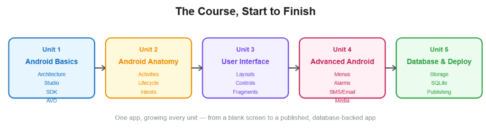
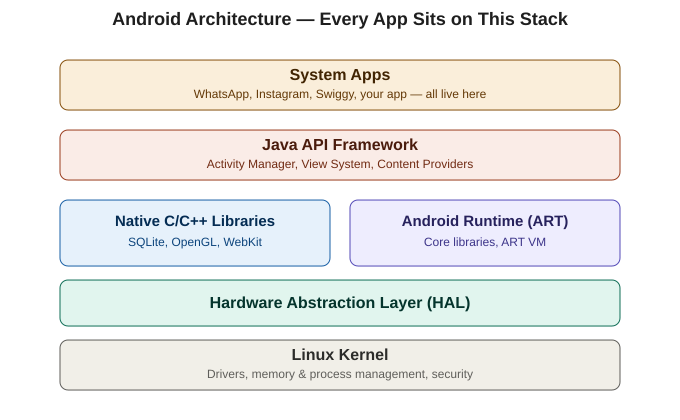
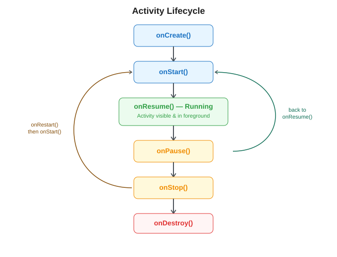
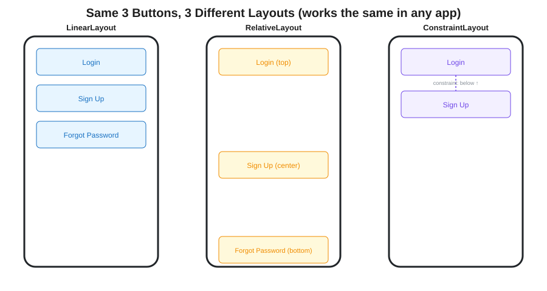
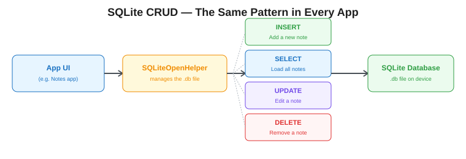

# Closing Session — Android Development, Units 1–5
### Final Recap | Diploma (Final Year) & B.Tech II Year | JNTUK

This session ties everything together. We built all five units around **CampusConnect**, but every concept below applies to *any* Android app — Instagram, WhatsApp, Swiggy, a banking app, Spotify. That's the point of today: see the pattern, not just the project.

---

## UNIT 1 — Android Basics

**The big idea:** Android isn't a mystery box. It's Linux at the bottom, your app at the top, with well-defined layers in between. Every app on your phone — Instagram, WhatsApp, a banking app — sits on this exact same stack.

### Q&A Recap

**Q: Differentiate SDK, ADT, and AVD.**
A: SDK = the full toolkit (libraries + APIs) used to *build* any Android app. ADT = the old Eclipse plugin, now replaced by Android Studio. AVD = a virtual phone used to *test* the app without a real device. Think of it as: SDK builds it, AVD runs it.

**Q: List five features of Android.**
A: Open source, layered architecture, rich UI framework, multitasking (background Services), built-in SQLite support. Example: Spotify multitasks (plays music while you browse other apps) — that's the multitasking feature in action.

**Q: Role of the Hardware Abstraction Layer (HAL)?**
A: It's the translator between your app's code and the phone's actual hardware (camera, sensors, Bluetooth). When Instagram opens your camera, it doesn't talk to the camera chip directly — HAL handles that translation.

**Q: Differentiate Dalvik VM and ART.**
A: Both run your app's compiled code. Dalvik (older) compiled code *while the app ran* (slower startup, less battery-efficient). ART (current) compiles ahead of time, at install — faster app launches, better battery life.

**Q: Explain Android architecture with a diagram.**
A: Five layers, bottom to top: **Linux Kernel** (drivers, memory) → **HAL** (hardware translation) → **Native Libraries/ART** (SQLite, graphics, code execution) → **Java API Framework** (Activity Manager, View System — what you code against) → **System Apps** (Instagram, WhatsApp, your app). See the diagram above.

**Q: Explain the anatomy of an Android application.**
A: Every app is built from four components, declared in `AndroidManifest.xml`: **Activity** (one screen — e.g., WhatsApp's chat screen), **Service** (background work, no UI — e.g., a music player continuing audio while you switch apps), **Broadcast Receiver** (reacts to system events — e.g., an alarm app waking up at the scheduled time), **Content Provider** (shares data with other apps — e.g., Contacts sharing names with Truecaller).

---

## UNIT 2 — Android Anatomy

**The big idea:** A screen isn't just "on" or "off" — Android constantly manages its visibility state, and screens talk to each other using Intents, not direct function calls.

### Q&A Recap

**Q: What is an Intent? List its types.**
A: An Intent is a messaging object that requests an action from another component. Two types: **Explicit** (you name the exact screen — e.g., tapping "Edit Profile" inside Instagram opens Instagram's own Edit Profile screen) and **Implicit** (you describe an action, Android finds the app — e.g., tapping "Share" on an Instagram post lets you pick WhatsApp, Gmail, or any app that can receive a share).

**Q: Purpose of `setContentView()`?**
A: It attaches an XML layout file to an Activity so the screen actually has something to display. Without it, the Activity exists in code but shows a blank screen.

**Q: Differentiate `startActivity()` and `startActivityForResult()`.**
A: `startActivity()` is fire-and-forget — open a screen, done (e.g., opening a product detail page in Amazon). `startActivityForResult()`/the Activity Result API expects data back (e.g., picking a delivery address from a map screen and returning it to the checkout screen).

**Q: What triggers `onPause()` vs `onStop()`?**
A: `onPause()` fires the moment the screen loses focus but is still partially visible (e.g., a call notification pops up over WhatsApp). `onStop()` fires once the screen is *completely* hidden (e.g., you press Home and go to a different app entirely).

**Q: Explain the Activity Lifecycle with a diagram and code example.**
A: `onCreate()` (screen built) → `onStart()` (becomes visible) → `onResume()` (interactive, in foreground) → `onPause()` (losing focus) → `onStop()` (fully hidden) → `onDestroy()` (cleaned up), with `onRestart()` looping back to `onStart()` when you return. Real example: open YouTube (`onCreate → onStart → onResume`), a call comes in (`onPause`), you finish the call and return (`onRestart → onStart → onResume`), you swipe YouTube away (`onDestroy`).

**Q: Differentiate Explicit and Implicit Intent with examples.**
A: Explicit names a class (navigation *within* one app — Instagram Home → Instagram Settings). Implicit names an action and lets Android resolve it (talking to *other* apps — tapping a phone number in any app opens whichever dialer app is installed).

**Q: How can data be returned from a child Activity to a parent?**
A: The child sets a result (`setResult(RESULT_OK, intent)`) and calls `finish()`; the parent registers a listener beforehand (`registerForActivityResult`) that receives that data when the child closes. Example: picking a photo from a gallery app and having it return to the app you started from (like setting a WhatsApp profile picture).

---

## UNIT 3 — Android User Interface

**The big idea:** The same content can be arranged differently depending on the layout you choose — and almost every interactive screen is really just "show data in a list, respond to taps."

### Q&A Recap

**Q: Differentiate LinearLayout and RelativeLayout.**
A: LinearLayout stacks children in one direction, in the order written (like a to-do list app's simple vertical form). RelativeLayout positions each child relative to the parent or other views using rules (like a dashboard where a badge sits pinned to the corner of a profile picture, regardless of the picture's size).

**Q: Purpose of an Adapter in Android?**
A: It bridges your raw data (a list of products, messages, songs) to the visual rows a `ListView`/`RecyclerView` displays. Every scrollable feed you've ever used — Instagram's feed, Amazon's product list, WhatsApp's chat list — is an Adapter turning data into rows.

**Q: Differentiate AlertDialog and DialogFragment.**
A: AlertDialog is quick and simple but gets lost if the screen rotates. DialogFragment survives rotation because the FragmentManager manages it. Example: a "Delete this photo?" prompt in a gallery app should be a DialogFragment — you don't want it to silently vanish if the phone rotates mid-decision.

**Q: Role of `onCreateView()` in a Fragment?**
A: A Fragment doesn't call `setContentView()` like an Activity does — it *returns* an inflated View from `onCreateView()` instead, because a Fragment is a piece of UI living inside an Activity, not a full screen on its own.

**Q: Explain the three layout types with XML examples.**
A: See the diagram above — same three buttons, three different results. LinearLayout = sequential stacking. RelativeLayout = position relative to siblings/parent. ConstraintLayout = a flexible constraint graph, the modern default (used because it avoids deeply nested layouts, which slows down rendering on complex screens like a shopping app's product page).

**Q: Explain how to populate a ListView using ArrayAdapter.**
A: Create a data source (a `List`), wrap it in an `ArrayAdapter` with a row layout, call `setAdapter()` on the ListView. This exact pattern powers Twitter's timeline, a food delivery app's restaurant list, and a banking app's transaction history — all "just" an Adapter feeding a scrollable list.

**Q: Explain Fragments and their lifecycle; write code to dynamically replace one.**
A: A Fragment is reusable, self-contained UI living inside an Activity — used for tab-based screens (like YouTube's Home/Shorts/Subscriptions tabs, all inside one Activity). Swapping them: `getSupportFragmentManager().beginTransaction().replace(containerId, newFragment).commit()`.

---

## UNIT 4 — Advanced Android

**The big idea:** Apps don't operate in isolation — they read device state, schedule future actions, and talk to *other* apps (dialer, SMS, email) instead of reinventing those features.

### Q&A Recap

**Q: Differentiate Options Menu, Context Menu, and Popup Menu.**
A: Options Menu = toolbar-triggered, whole-screen actions (Gmail's overflow menu → Settings/Help). Context Menu = long-press on one specific item (long-pressing an email → Archive/Delete/Mark unread). Popup Menu = anchored to a specific button (a "Sort by" button showing Newest/Oldest/Price).

**Q: Difference between `ACTION_DIAL` and `ACTION_CALL`?**
A: `ACTION_DIAL` opens the dialer with the number pre-filled — user must tap Call themselves, no special permission needed. `ACTION_CALL` calls immediately and requires the `CALL_PHONE` runtime permission. Almost every app (Zomato's "Call Restaurant" button, Truecaller) uses `ACTION_DIAL` specifically to avoid needing that sensitive permission.

**Q: Why must `MediaPlayer.release()` be called in `onDestroy()`?**
A: `MediaPlayer` holds onto native system resources outside normal Java memory — not releasing it causes leaks across screen restarts. Any music/podcast app that doesn't do this correctly will drain battery and eventually crash after repeated use.

**Q: Differentiate ImageView, ImageButton, and ImageSwitcher.**
A: ImageView shows a static image (a profile picture). ImageButton is a clickable image (a heart icon you tap to like a post). ImageSwitcher animates between images using a ViewFactory (swiping through an Instagram post's multiple photos).

**Q: Explain AlarmManager with a BroadcastReceiver — trace the full flow.**
A: `AlarmManager` schedules a future trigger time via a `PendingIntent` → at that time, Android fires the `BroadcastReceiver`'s `onReceive()` → that code builds and shows a notification via `NotificationManager`. This exact chain is how *every* reminder app, medicine-alarm app, or calendar-event notification works — not just class reminders.

**Q: Write code to send SMS and Email using implicit Intents; explain required permissions.**
A: `Intent(Intent.ACTION_SENDTO)` with a `smsto:` or `mailto:` URI opens the SMS/Email app with content pre-filled — no special permission needed, because you're *handing off* to another app, not sending directly yourself. (Directly sending SMS from your own code via `SmsManager` *would* need the `SEND_SMS` permission — worth knowing the distinction.)

**Q: Explain the AlertDialog class with a practical example.**
A: A simple, quick popup for confirmations that don't need to survive rotation — e.g., "Log out of your account?" in nearly any app, built with `AlertDialog.Builder`, a title, message, and positive/negative buttons.

---

## UNIT 5 — Database & Persistence

**The big idea:** Data that doesn't survive an app restart isn't very useful. This unit is about choosing the right persistence tool for the job, and SQLite specifically for anything structured and queryable.

### Q&A Recap

**Q: Differentiate `apply()` and `commit()` in SharedPreferences.**
A: `apply()` writes in the background, doesn't block the UI (preferred — e.g., saving a "dark mode" toggle instantly without freezing the screen). `commit()` writes immediately and returns success/failure — use only when you genuinely need to confirm the write happened before proceeding.

**Q: Differentiate Internal and External Storage.**
A: Internal = private to your app, deleted on uninstall (e.g., WhatsApp's cached thumbnails). External = visible to other apps, survives uninstall (e.g., a PDF scanner app saving files to the Downloads folder so you can open them in any PDF viewer).

**Q: Purpose of a Content Provider?**
A: Standardizes how one app exposes structured data to *other* apps through `content://` URIs. Classic example: the Contacts app exposing your saved contacts so Truecaller, WhatsApp, and your Email app can all read (but not directly access the raw file of) the same contact list.

**Q: Why must a Cursor always be closed after use?**
A: A `Cursor` holds a live connection to query results; leaving it open leaks memory and can eventually slow down or crash the app — the same reason you'd close a book instead of leaving every book you've ever opened stacked open on your desk.

**Q: Design a SQLite schema for a student attendance system.**
A: `students(roll_no PK, name, dept)`, `attendance(id PK, roll_no FK, subject, status, date)` — one-to-many from students to attendance records. The same shape works for *any* one-to-many relationship: a banking app's `customers` → `transactions`, or a food app's `restaurants` → `orders`.

**Q: Write a complete SQLiteOpenHelper subclass with Insert, Update, Delete, Fetch.**
A: Extend `SQLiteOpenHelper`, override `onCreate()`/`onUpgrade()` to define/version tables, then: `db.insert()` with `ContentValues` for Insert, `db.query()` returning a `Cursor` (loop with `moveToNext()`, then `close()`) for Fetch, `db.update()` for Update, `db.delete()` for Delete. This exact four-method shape is what powers a Notes app, an expense tracker, or a to-do list app under the hood.

**Q: Explain the different types of persistent storage with examples.**
A: SharedPreferences (small settings — theme, login state), Internal Storage (private files — cached images), External Storage (shareable files — exported reports, downloaded PDFs), SQLite (structured, queryable data — transaction history, chat messages, saved posts).

**Q: Explain the steps to generate a signed APK and publish an app.**
A: Build a release version → sign it with a Keystore (proves the update genuinely comes from you) → run it through ProGuard/R8 (shrinks and obfuscates code) → get a distributable APK/AAB → install directly or upload to Play Console. Every app on the Play Store — big or small — went through exactly these five steps once.

---

## The One-Sentence Version of Each Unit

1. **Unit 1:** Every app — yours or Instagram's — runs on the same Linux-based stack, built and tested with Android Studio's SDK and AVD tools.
2. **Unit 2:** Screens are Activities with a managed lifecycle, and they talk to each other (and other apps) through Intents.
3. **Unit 3:** Layouts arrange what's on screen; Adapters turn data into scrollable lists; Fragments let one screen host multiple interchangeable sections.
4. **Unit 4:** Real apps reach beyond their own UI — menus, dialogs, scheduled alarms, and handing off to the phone's dialer/SMS/email/media system.
5. **Unit 5:** Data has to survive a restart to be useful — pick SharedPreferences, Internal/External Storage, or SQLite based on what kind of data it is, then package and publish the finished app.

**And the throughline across all five:** none of this is CampusConnect-specific. It's the same architecture, lifecycle, navigation, UI, and storage pattern behind every Android app on your phone right now.
